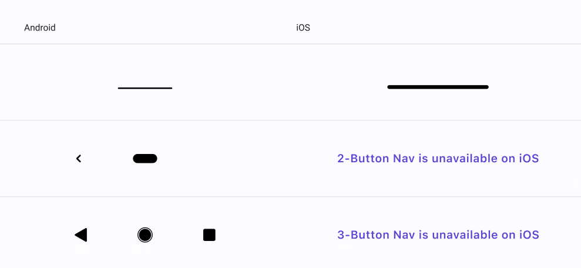

# Bottom Bar

> **Note:**  **Bottom Bar** is only ornamental, it will not affect the plugin at all.

| Property | Options                                   | Description                                                  |
| -------- | ----------------------------------------- | ------------------------------------------------------------ |
| OS       | `iOS, Android`                            | Changes the style of the Bottom Bar to fit the desired OS.   |
| Theme    | `Light, Dark`                             | Changes the theme of the Bottom Bar.                         |
| Nav Type | `Gesture Nav, 2-Button Nav, 3-Button Nav` | Changes the content of the Bottom Bar. *2-Button Nav* and *3-Button Nav* are unavailable if the **OS** is set to *iOS*. |