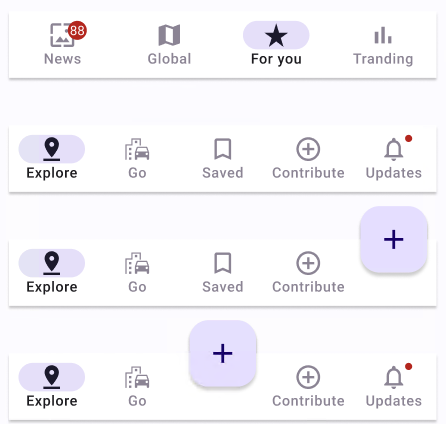

# Bottom Navigation Bar

> **Note:** The **Bottom Navigation Bar** has a few important details that must be known. First of all the colors can be overridden using the **Selection colors** property from Figma. There is also the fact that the size of the component will not change based on the labels. The **badge** won't be displayed in the plugin. Finally, there is a known issue  where content around the **FAB** will be hidden.

| Property | Options   | Description                                          |
| -------- | --------- | ---------------------------------------------------- |
| Item     | `3, 4, 5` | Decides the quantity of items that will be displayed |

### Extra Customization

> To reach the extra customization features you will need to work your way through the hierarchy of the component to find the specified sub-components.  You can also remove items from the plugin by hiding them in Figma. They will appear as **TabBarItem** or **Template/.TabBarItem**. 

- **icon:** Changes the icon of one of the items of the **Bottom Navigation Bar**, the name of this property depends on the icon itself.
- **Label:** Allows you to change the text of one of the items label.
- **FAB:** See **[FAB](./fab.md)** for all the possible customizations.
