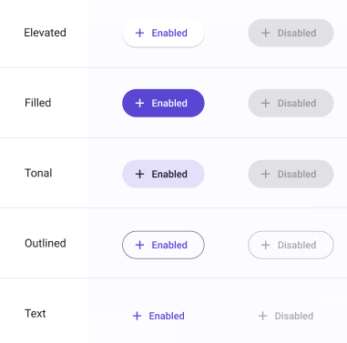

# Button
> **Note:** The **Button** allows developers and designers to override the background's color via the Selection colors option

> **Binding:** By default, Data set with the **Content** field in the **Properties** tab in the plugin will be applied to the *Content* property for this component.

| Property | Options                                         | Description                                                  |
| -------- | ----------------------------------------------- | ------------------------------------------------------------ |
| Type     | `Elevated, Filled, Text, Outlined, FilledTonal` | Changes the style of the button                              |
| Icon     | `True/False`                                    | Adds an icon before the label                                |
| State    | `Enabled, Disabled, Hovered, Focused, Pressed`  | Alters the current state of the component, although it doesn't affect the plugin |

### Extra Customization
> To reach the extra customization features you will need to work your way through the hierarchy of the component to find the specified sub-components.  

- **icon:** Allows you to change the icon of the **Button**. It will only be displayed if  the **Icon** property is enabled.
- **Label:** Allows you to change the text of the **Button's** label.
