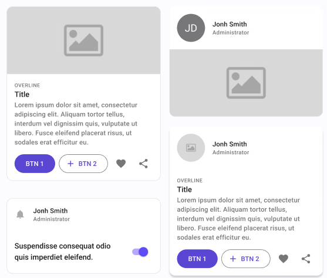
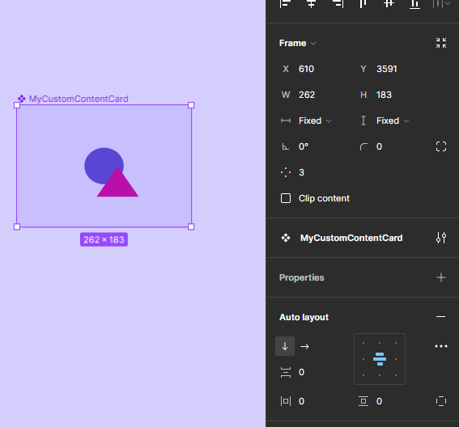
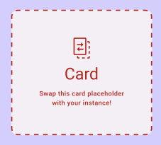
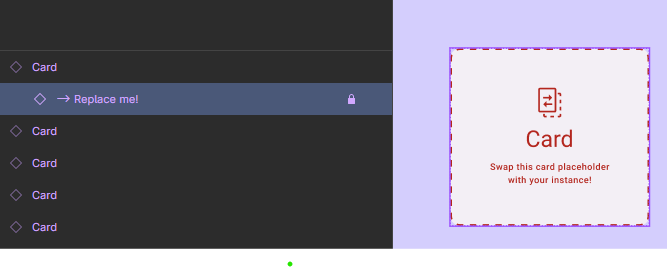
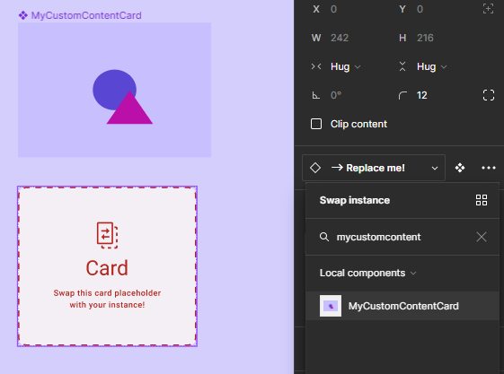
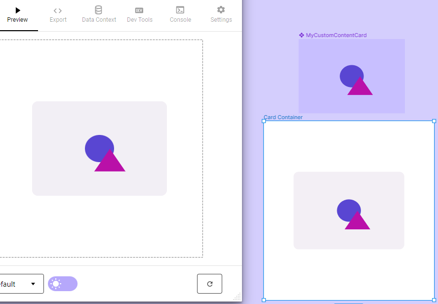
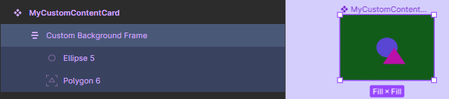
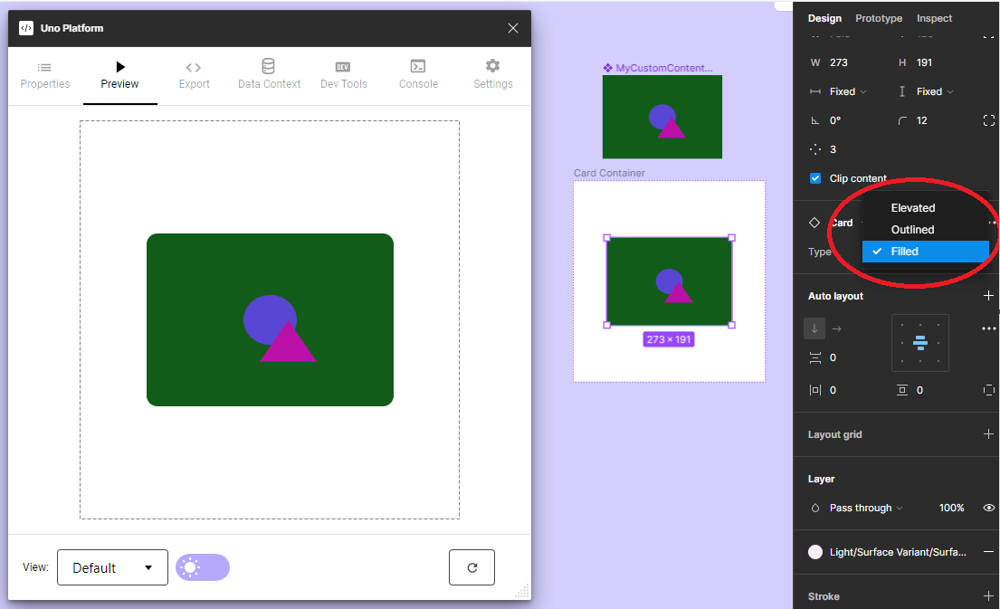

# Card

> **Note:** The **PersonPicture** located in the **Header** will by default have the **Type** Icon

| Property | Options              | Description                                                  |
| -------- | -------------------- | ------------------------------------------------------------ |
| Type     | `Elevated, Outlined` | Changes the style of the card                                |
| Header   | `True/False`         | Adds a header that includes a **ProfilePicture** and some text at the top of the card |
| Media    | `True/False`         | Adds an **Image** in the middle of the card                  |
| Body     | `True/False`         | Adds some text and **Buttons** at the bottom of the card     |

### Extra Customization

> To reach the extra customization features you will need to work your way through the hierarchy of the component to find the specified sub-components.  

- **ListItem:** Allows you to change the content of the **Header**. It will only be displayed if  the **Header** property is enabled. See **[ListItem](./list-item.md)** for all the possible customizations.
- **Image:** Allows you to change the image present in the **Media** section. It will only be displayed if  the **Media** property is enabled. See **[Image](./image.md)** for all the possible customizations.
- **ListItem:** Allows you to change the content of the **Body**. It will only be displayed if  the **Body** property is enabled. See **[ListItem](./list-item.md)** for all the possible customizations.

# Card Container

Containers are components that contain only a swappable placeholder. The placeholder is a dummy component you can swap with your own component or even with another component from the library.

If you want a completely different content from the existent Card component, you can use a Card Container. 
Here are the steps:

### Steps to create your own Custom Content Card

Part 1:

1. Create a new frame;
2. Edit its content with the look and feel you want for your Card;
3. Convert it to a component, choose a name for it. **Important:** the name must be diferent from "Card";

Part 2:

1. Add an instance of a Card Container component in the place you desire, this is how it looks like: 

2. In the "Layers" tree, select its first content node usually named as **-> Replace me!**.

3. Go to the "Design" tab and swap this instance to your recent created component;

4. At this moment the Card visual will be changed, showing in its content the component you have created;
5. You will probably need to resize the Card Instance and its container to better reproduce your design; 
6. That's it! Now you can run the plugin to generate the screen you created;

> **Note:** For custom content Cards, Plugin will not be able to detect [Overrides](../learn/designers/overrides.md). 

> **Note:** The Card's background is managed by the variant properties defined in the main component, in this case, the Type property - Elevated, Outlined or Filled. The variant background option will override the background color of the Content node, as you can see in the previous picture. In case you want to preserve the color you have selected in your Custom Content component, just add a second frame inside of it and choose the Fill color you desire. The result will be like:

> **Note:** You will find more detailed information about Cards and other components at **Components Page** in the [Uno Platform Material Toolkit](../download.md).
