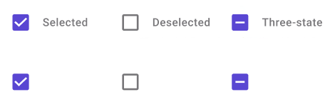

# CheckBox

**Binding:** By default, Data set with the **Content** field in the **Properties** tab in the plugin will be applied to the *IsChecked* property for this component.

| Property | Options                                              | Description                                                  |
| -------- | ---------------------------------------------------- | ------------------------------------------------------------ |
| Property | `Three-state, Selected, Deselected`                  | Displays the combo box as if it is selected, deselected or indeterminate. This will not be displayed in the plugin |
| Label    | `True/False`                                         | Adds a label on the right side of the check box              |
| State    | `Enabled, Disabled, Pressed, Focused, Indeterminate` | Alters the current state of the component, although it doesn't affect the plugin |

### Extra Customization

> To reach the extra customization features you will need to work your way through the hierarchy of the component to find the specified sub-components.  

- **Content:** Allows you to change the text of the **CheckBox's** label. It will only be displayed if  the **Label** property is enabled.