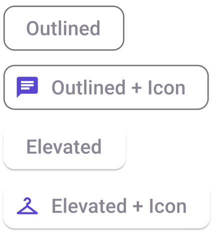

# Chip

> **Binding:** By default, Data set with the **Content** field in the **Properties** tab in the plugin will be applied to the *Content* property for this component.

| Property | Options                                    | Description                                                  |
| -------- | ------------------------------------------ | ------------------------------------------------------------ |
| Type     | `Outlined, Elevated`                       | Displays the button as if it is clicked or not. This will not be displayed in the plugin |
| State    | `Enabled, Hover, Focus, Pressed, Disabled` | Alters the current state of the component, although it doesn't affect the plugin |
| Leading  | `True, False`                              | Alters the visibility of the leading icon of the component |
| Text     | `Text field`                               | Changes the text content of the component           |
| Trailing | `True, False`                              | Alters the visibility of the trailing icon of the component |

### Extra Customization

> To reach the extra customization features you will need to work your way through the hierarchy of the component to find the specified sub-components.  