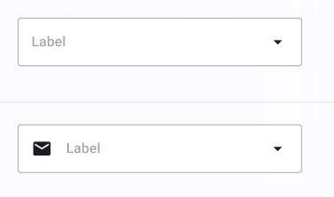

# ComboBox

| Property | Options         | Description                                    |
| -------- | --------------- | ---------------------------------------------- |
| Style    | `Outlined`      | Changes the style of the combo box             |
| Icon     | `None, Leading` | Adds an icon before the label of the combo box |

### Extra Customization

> To reach the extra customization features you will need to work your way through the hierarchy of the component to find the specified sub-components.  

- **LeadingIcon:** Allows you to change the icon in front of the **ComboBox**. It will only be displayed if  the **Icon** property is enabled.
- **Label:** Allows you to change the text of the **ComboxBox's** label.
- **TrailingIcon:** Allows you to change the icon at the back of the **ComboBox**. This modification will not affect the plugin.

### Overridable Properties

- **Background** 
- **Foreground** 