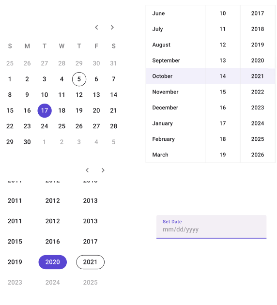

# DatePicker

> [!NOTE]
> Currently, the only **DatePickers** that are displayed properly are the ones with the **Type** property set to **Icon**. Any other **DatePickers** will look as if it was also set to **Icon**.

| Property | Options                   | Description                                                  |
| -------- | ------------------------- | ------------------------------------------------------------ |
| Type     | `Calendar, Input, List`   | Changes the style of the DatePicker. Only Input will be displayed properly in the plugin. |
| Format   | `Day, Decade, mm/dd/yyyy` | Changes which dates and how they are displayed in the **DatePickers**. *Day* and *Decade* only work for **Calendar** and *mm/dd/yyyy* only works for **Input** and **List**. This property will not influence the plugin |
| Display  | `In page, Modal`          | Adds a **Select Date** section to the DatePicker if it is set to **Modal**. This property doesn't affect the plugin |

## Extra Customization

To reach the extra customization features, you will need to work your way through the hierarchy of the component to find the specified sub-components.

- **Text:** Allows you to change the text of the **DatePicker's** header.
