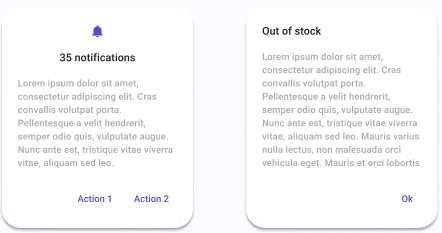

# Dialog

| Property | Options      | Description                                                  |
| -------- | ------------ | ------------------------------------------------------------ |
| Title    | `True/False` | Adds a title and some extra text                             |
| Icon     | `True/False` | Adds an extra icon at the top and centers the icon and the title. If enabled, it will also enable **Title**. |
| Button   | `1, 2`       | Adds the selected number of **Buttons** at the bottom right of the Dialog |

## Extra Customization

To reach the extra customization features, you will need to work your way through the hierarchy of the component to find the specified sub-components.

- **Icon**: Changes the icon at the top of the dialog. To see the modifications, the **Icon** property must be enabled.
- **Title**: Changes the text of the **Dialog's** title. It will be displayed if the **Title** property is enabled. It also can be removed if hidden.

- **Body**: Changes the text of the **Dialog's** body. It will be displayed if the **Title** property is enabled. It also can be removed if hidden.
- **Button:** Changes the buttons that are in the **Dialog**. See **[Button](./button.md)** for all the possible customizations.
