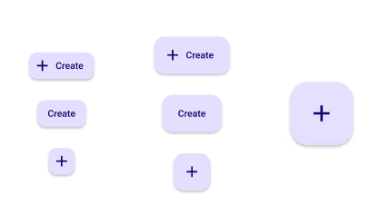

# Floating Action Button (FAB)

> **Tip:** The standard usage of the **FAB** is to use the default size.

| Property | Options                        | Description                                                  |
| -------- | ------------------------------ | ------------------------------------------------------------ |
| Type     | `Small, Default, Large`        | Changes the size of the FAB. A Large FAB cannot have a label |
| Label    | `True/False`                   | Adds a label on the right side of the FAB. If it is disabled, **Icon** will be set to True |
| Icon     | `Default, True`                | Adds an icon on the left side of the FAB. If set to Default, **Label** will be enabled. The Icon will also be larger if the **Type** is Large. |
| State    | `Enabled, Hover, Focus, Press` | Alters the current state of the component, although it doesn't affect the plugin |

### Extra Customization

> To reach the extra customization features you will need to work your way through the hierarchy of the component to find the specified sub-components.  

- **Icon:** Allows you to change the icon in front of the **FAB**. It will only be displayed if  the **Icon** property is set to True.
- **Label:** Allows you to change the text of the **FAB's** label. It will only be displayed if  the **Label** property is enabled.