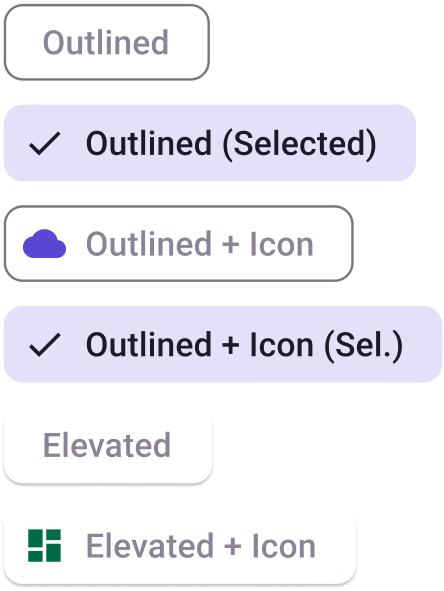

# FilterChip

> **Note:** For any type of **Chips** to be displayed properly the type of the **Layout** in the plugin must be set to **Group**. You also should put more than one **Chip** in the same **AutoLayout**.

> **Binding:** By default, Data set with the **Content** field in the **Properties** tab in the plugin will be applied to the *Content* property for this component.

| Property | Options                                           | Description                                                  |
| -------- | ------------------------------------------------- | ------------------------------------------------------------ |
| Type     | `Outlined, Elevated`                              | Changes the style of the filter chip                         |
| Selected | `True/False`                                      | Displays the filter chip as if it is selected or not. It also adds a checkmark icon on the left side of the filter chip. If it is enabled **Leading** will also be enabled |
| Leading  | `True/False`                                      | Adds an icon on the left side of the filter chip             |
| State    | `Dragged, Enabled, Disabled, Hover, Focus, Press` | Alters the current state of the component, although it doesn't affect the plugin |

### Extra Customization

> To reach the extra customization features you will need to work your way through the hierarchy of the component to find the specified sub-components.  

- **Icon:** Allows you to change the icon of the **Filter chip**. It will only be displayed if  the **Leading** property is enabled.
- **Label:** Allows you to change the text of the **Filter chip's** label.