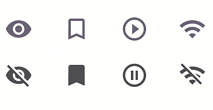

# IconToggleButton

> **Note:** The color of the **IconToggleButton** can be modified via the **Selection colors** option. The color must be modified for both the checked AND unchecked sub-components in the **IconToggleButton's** hierarchy

> **Binding:** By default, Data set with the **Content** field in the **Properties** tab in the plugin will be applied to the *IsChecked* property for this component.

| Property | Options                                  | Description                                                  |
| -------- | ---------------------------------------- | ------------------------------------------------------------ |
| Type     | `Wifi, Play/Pause, Bookmark, Visibility` | Changes the icon                                             |
| State    | `Enabled, Disabled, Hover, Focus, Press` | Alters the current state of the component, although it doesn't affect the plugin |

### Extra Customization

> To reach the extra customization features you will need to work your way through the hierarchy of the component to find the specified sub-components.  

- **Checked > Icon:** Allows you to change the icon  of the **IconToggleButton** beyond the options given in **Type**. This will only affect the icon while it is **Checked** in the plugin.
- **Unchecked > Icon:** Allows you to change the icon  of the **IconToggleButton** beyond the options given in **Type**. This will only affect the icon while it is **Unchecked** in the plugin.
