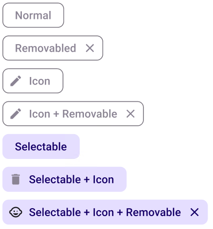

# InputChip

> **Note:** For any type of **Chips** to be displayed properly the type of the **Layout** in the plugin must be set to **Group**. You also should put more than one **Chip** in the same **AutoLayout**.

> **Binding:** By default, Data set with the **Content** field in the **Properties** tab in the plugin will be applied to the *Content* property for this component.

| Property  | Options                                           | Description                                                  |
| --------- | ------------------------------------------------- | ------------------------------------------------------------ |
| Removable | `True/False`                                      | Adds an 'X' on the right side of the input chip. In the plugin, this will be enabled for every input chip |
| Selected  | `True/False`                                      | Displays the input chip as if it is selected or not.  It will not be displayed in the plugin |
| Leading   | `True/False`                                      | Adds an icon on the left side of the input chip              |
| State     | `Dragged, Enabled, Disabled, Hover, Focus, Press` | Alters the current state of the component, although it doesn't affect the plugin |

### Extra Customization

> To reach the extra customization features you will need to work your way through the hierarchy of the component to find the specified sub-components.  

- **Icon:** Allows you to change the left side icon of the **Input chip**. It will only be displayed if the **Leading** property is enabled.
- **Label:** Allows you to change the text of the **Input chip's** label.
- **TrailingIcon:** Allows you to change the right side icon of the **Input chip**. It will only be displayed if the **Removable** property is enabled. This will not change anything in the plugin.