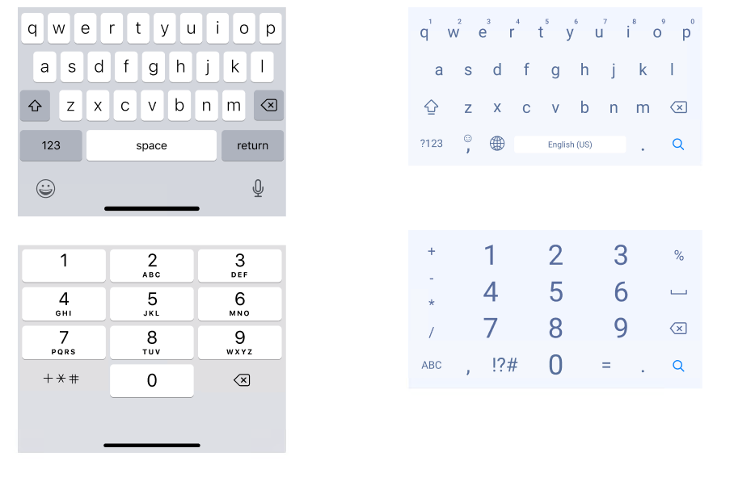

# Keyboard

> **Note:**  **Keyboard** is only ornamental, it will not affect the plugin at all.

| Property | Options          | Description                                              |
| -------- | ---------------- | -------------------------------------------------------- |
| Theme    | `Light, Dark`    | Changes the theme of the Keyboard.                       |
| OS       | `Android, iOS`   | Changes the style of the Keyboard to fit the desired OS. |
| Type     | `Letter, Number` | Changes the content of the Keyboard.                     |