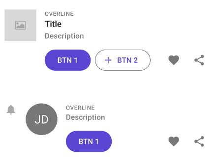

# ListItem

> **Note:** If you want to use horizontal swiping features, you should use **[SwipeControl]()** instead.

| Property           | Options             | Description                                                  |
| ------------------ | ------------------- | ------------------------------------------------------------ |
| Leading            | `True/False`        | Adds one or multiple components at the top left of the **ListItem**. By default, it will be an  **Image**. |
| Primary Commads    | `True/False`        | Adds 2 **Buttons** at the bottom of the **ListItem**         |
| Secondary Commands | `True/False`        | Adds 2 **IconButtons** at the bottom right of the **ListItem**. By default, they will be  a "Like" and a "Share" icons. |
| Trailing           | `True/False`        | Doesn't affect the plugin or the component.                  |
| State              | `Enabled, Disabled` | Alters the current state of the component, although it doesn't affect the plugin |

### Extra Customization

> To reach the extra customization features you will need to work your way through the hierarchy of the component to find the specified sub-components. You can remove those components from the plugin by hiding them in Figma. You can add them by doing the opposite.

- **Leading**: Allows you to change the components that will be displayed at the top left of the **ListItem**. It will only be displayed if the **Leading** property is enabled. The possible components are :

  - **Icon**: By default it is a "Bell", but it can be modified

  - **CheckBox**: See **[CheckBox]()** for all the possible customizations.
  - **PersonPicture**: See **[PersonPicture]()** for all the possible customizations.
  - **Image**: The default option, see **[Image]()** for all the possible customizations.

- **OVERLINE**: Changes the first line of text.

- **Subtitle**: Changes the second line of text.

- **Secondary Text**: Changes the last line of text.

- **Primary Commands > Button x2**: Changes the two **Buttons** at the bottom, see **[Button](./button.md)** for all the possible customizations. It will only be displayed if the **Primary Commands** property is enabled.

- **Secondary Commands > IconButton x2**: Changes the two **IconButtons** at the bottom right, see **[IconButton](./icon-button.md)** for all the possible customizations. It will only be displayed if the **Secondary Commands** property is enabled.