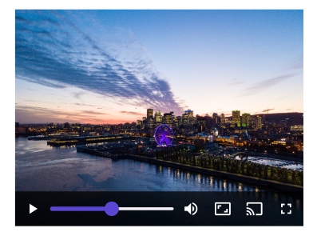

# MediaPlayerElement

| Property | Options          | Description                                                  |
| -------- | ---------------- | ------------------------------------------------------------ |
| Compact  | `True/False`     | Changes the layout of the transport controls panel           |

### Extra Customization
> To reach the extra customization features you will need to work your way through the hierarchy of the component to find the specified sub-components.  