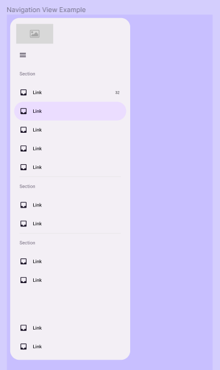

# Navigation View

## Component Properties

| Property       | Options            | Description                                                  |
| -------------- | ------------------ | ------------------------------------------------------------ |
| Collapse       | `True/False`       | Changes the state of the Navigation View between collapsed and extended |
| Header Content | `Toggle/Toggle & FAB/Toggle & Custom/Back & Toggle` | Changes the Navigation View Header style |
| Section #X     | `True/False`       | Shows / Hide the respective Navigation View Section                    |
| Footer         | `True/False`       | Shows / Hide the Navigation View Footer                                |

## Navigation Section Properties

| Item #X        | `True/False`       | Shows / Hide the respective Navigation Item in the Section   |
| Divider        | `True/False`       | Shows / Hide the divider at the ending of the Section        |

## Navigation Item Properties

| Property       | Options            | Description                                                  |
| -------------- | ------------------ | ------------------------------------------------------------ |
| Label text     | `True/False`       | Shows / Hide the Item Label                                  |

## Extra Customization

To reach the extra customization features, you will need to work your way through the hierarchy of the component to find the specified sub-components.

- **Leading / Icon:** Allows you to change the vector of the **Navigation View Item's** icon.
- **Content:** Allows you to change the text of the **Navigation View Item's** label.

- **Section Label:** Allows you to change the text of the **Navigation Section's** label.
