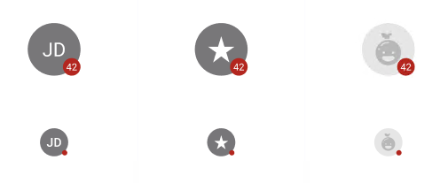

# PersonPicture

> **Binding:** By default, Data set with the **Content** field in the **Properties** tab in the plugin will be applied to the *ProfilePicture* property for this component.

| Property | Options               | Description                                                  |
| -------- | --------------------- | ------------------------------------------------------------ |
| Badge    | `True/False`          | Adds a small notification badge at the bottom right of the PersonPicture. |
| Type     | `Picture, Name, icon` | Changes the icon of the PersonPicture. In the plugin, the type will be Icon. |
| Size     | `Large, Small`        | Changes the width and the height of the PersonPicture.       |
