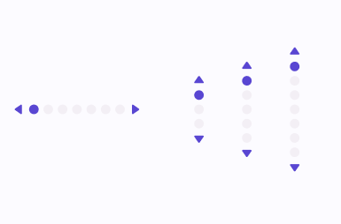

# Pips Pager

| Property | Options       | Description                      |
| -------- | ------------- | -------------------------------- |
| NumberOfPages   | `Integer` | Number of pips / icons |
| Orientation   | `Horizontal` | `Vertical` | Orientation of the Pips Pager |
| Show Carets   | `True` | `False` | Changes Visibility of Next and Previous Buttons |

