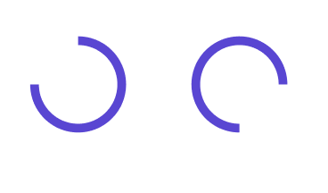

# ProgressRing

> **Note:** Currently the **ProgressRing** is not affected by the **Selection colors** property from Figma. In other words, the **ProgressRing** will always be the same colors in the plugin.

| Property | Options                      | Description                                                  |
| -------- | ---------------------------- | ------------------------------------------------------------ |
| State    | `Determinate, Indeterminate` | Changes the display of the ProgressRing to show how much of the task is done via a percentage (*Determinate*) or to keep that information away from the user (*Indeterminate*). |

