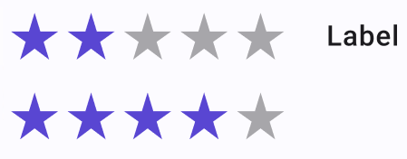

# RatingControl

**Binding:** By default, Data set with the **Content** field in the **Properties** tab in the plugin will be applied to the *Value* property for this component.

| Property | Options      | Description                                                  |
| -------- | ------------ | ------------------------------------------------------------ |
| Label    | `True/False` | Adds a label on the right side of the RatingControl. This label will not be shown in the plugin |

## Extra Customization

To reach the extra customization features, you will need to work your way through the hierarchy of the component to find the specified sub-components.

- **Label:** Allows you to change the text of the **RatingControl's** label. It will only be displayed if  the **Label** property is enabled.
- **Template/.RatingControlIconState > Active:** This property allows you to change the state of one of the stars of the RatingControl. You cannot only see those changes in the plugin.
