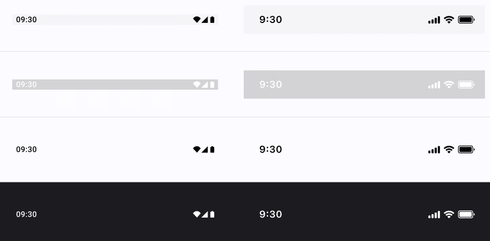

# Status Bar

> **Note:**  **Status Bar** is only ornamental, but it will generate metadata appearing when exporting the XAML. Only the background color can be modified  via the Selection colors option.

| Property         | Options                           | Description                                                  |
| ---------------- | --------------------------------- | ------------------------------------------------------------ |
| OS               | `iOS, Android`                    | Changes the style of the Status Bar to fit the desired OS. This property doesn't affect the plugin. |
| Foreground Color | `Auto, Auto Inverse, Light, Dark` | Changes the theme that the Status Bar will have in the the application. *Auto* sets the theme to the same as the device. *Auto Inverse* sets the theme to the opposite of the device's theme. For example, your device is set to Light, but while in your application the Status Bar will appear as dark. |
