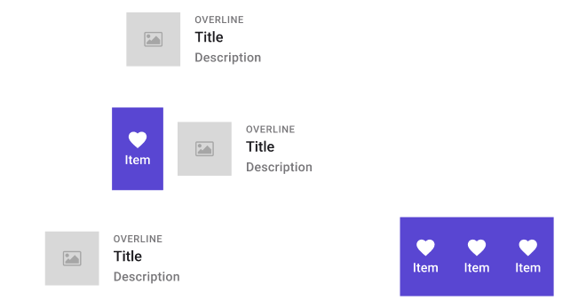

# SwipeControl

> **Note:** When rendering a **SwipeControl** using the Uno Plugin only the first element of the list will rendered, but the the other elements will still be present. To actually see the swiping in effect while using the plugin, you will need to use a touch screen.

| Property    | Options                                  | Description                                                  |
| ----------- | ---------------------------------------- | ------------------------------------------------------------ |
| State       | `Resting, Expanded left, Expanded right` | Alters the current state of the component, although it doesn't affect the plugin |
| Left items  | `0, 1`                                   | Sets the amount of items on the left side of the **SwipeControl** |
| Right items | `0, 1, 2, 3`                             | Sets the amount of items on the right side of the **SwipeControl** |

### Extra Customization

> To reach the extra customization features you will need to work your way through the hierarchy of the component to find the specified sub-components.

- **Template/.SwipeControlItem**: Those sub-components include the content of one of the left or right item. The quantity of those templates is decided by the **Left items** and **Right items** proerties. Although it displays an image in the Plugin it still has two properties :
  - **Icon**: By default it is a "Heart", but it can be modified
  - **Content**: Changes the text displayed under the icon.
- **OVERLINE**: Changes the first line of text, it can be removed if hidden.
- **Subtitle**: Changes the second line of text, it can be removed if hidden.
- **Secondary Text**: Changes the last line of text, it can be removed if hidden.