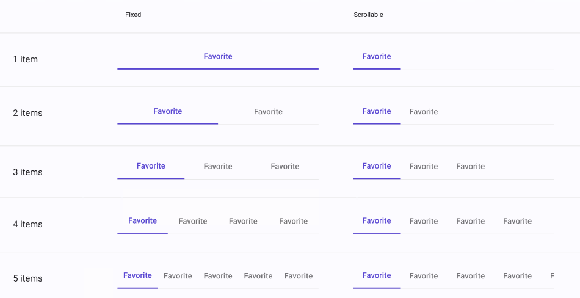

# Tab Bar

> **Binding:** By default, Data set with the **Content** field in the **Properties** tab in the plugin will be applied to the *Content* property for the **TabBarItem**.

| Property   | Options         | Description                                                  |
| ---------- | --------------- | ------------------------------------------------------------ |
| Item       | `1, 2, 3, 4, 5` | Changes the amount of icons present in the **TabBar**        |
| Scrollable | `True/False`    | Changes the alignemnt of the items in the **TabBar** as well as the items' width. |

### Extra Customization

> To reach the extra customization features you will need to work your way through the hierarchy of the component to find the specified sub-components.  

- **Icon:** Changes the icon for one of the items of the **Tab Bar**, each item is in its own **TabBarItem** .
- **Content:** Allows you to change the text of the items label, each item is in its own **TabBarItem** .