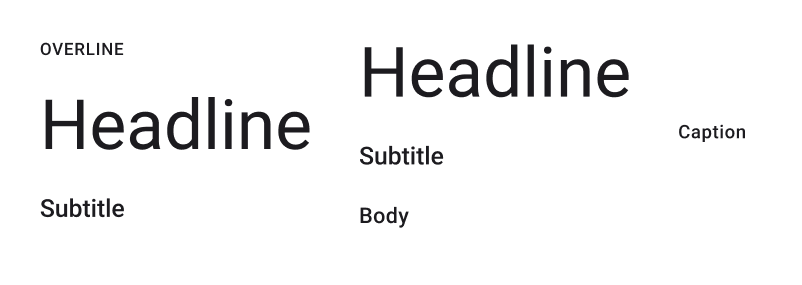

# Text Block

> **Note:** **Text Block** and the **Text** option from Figma will both affect the plugin in a similar way. **Text Block** only presets the formatting.

> **Binding:** By default, Data set with the **Content** field in the **Properties** tab in the plugin will be applied to the *Text* property for this component.

| Property | Options      | Description                                                  |
| -------- | ------------ | ------------------------------------------------------------ |
| Overline | `True/False` | Adds information at the top of the Text Block. If it is enabled, it will force *Body* and *Caption* to be disabled. |
| Headline | `True/False` | Adds a title. If its is enabled, *Caption* will be disabled. If you want to enable *Body*, *Subtitle* must also be enabled. |
| Subtitle | `True/False` | Adds a subtitle. If its is enabled, *Caption* will be disabled. If you want to enable *Overline*, *Headline* must also be enabled. |
| Body     | `True/False` | Adds the Text Block's body. If its is enabled, only *Subtitle* can be enabled.  If you want to enable *Headline*, *Subtitle* must also be enabled. |
| Caption  | `True/False` | Adds a caption to the Text Block.  If it is enabled, it will force all the other properties to be disabled. |

### Extra Customization

> To reach the extra customization features you will need to work your way through the hierarchy of the component to find the specified sub-components.  

- **Overline, Headline, Subtitle, Body, Caption:** Allows you to change the text of one of the **Text Block's** label. If the equivalent property is disabled the label will simply not appear. 