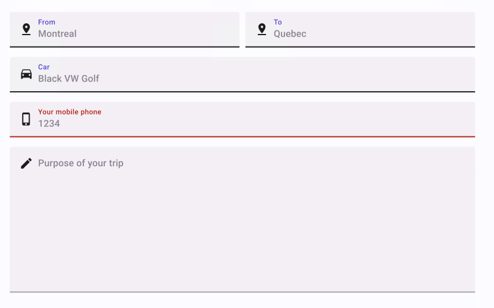

# TextBox

> **Note:** The **TrailingIcon** of the TextBox will always be the "X" icon whether or not it is changed in Figma.

## Component Properties

| Property     | Options                                          | Description                                                  |
| ------------ | ------------------------------------------------ | ------------------------------------------------------------ |
| Type         | `Filled, Outlined`                               | Changes the style of the TextBox                            |
| State        | `Enabled, Hovered, Focused, Disabled`            | Alters the current state of the component, although it doesn't affect the plugin |
| Multiline    | `True/False`                                     | Enables or disables the multiline feature for the TextBox    |
| Label        | `True/False`                                     | Show or hide Label                                           |
| Populated    | `True/False`                                     | Show or hide input text content                              |

## Content Template Properties

| Leading            | `True/False`                             | Adds an icon on the left of the TextBox input             |
| Label              | `True/False`                             | Show or hide Label                                        |
| Input Text         | `True/False`                             | Show or hide input text content                           |
| Trailing           | `True/False`                             | Swap visibility of a clear icon. Doesn't affect Plugin    |

### Extra Customization

> To reach the extra customization features you will need to work your way through the hierarchy of the component to find the specified sub-components.  