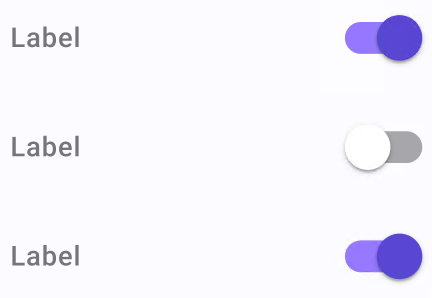

# Toggle Switch

> **Binding:** By default, Data set with the **Content** field in the **Properties** tab in the plugin will be applied to the *IsOn* property for this component.

| Property | Options                                    | Description                                                  |
| -------- | ------------------------------------------ | ------------------------------------------------------------ |
| Selected | `Deselected, Selected`                     | Displays the toggle switch as if it is selected or not. This will not be displayed in the plugin |
| Icons    | `Always, Selected Only, None`              | Defines how icons will be available accordingly to selection value |
| State    | `Disabled, Enabled, Hover, Focus, Pressed` | Alters the current state of the component, although it doesn't affect the plugin |

### Extra Customization

> To reach the extra customization features you will need to work your way through the hierarchy of the component to find the specified sub-components.  