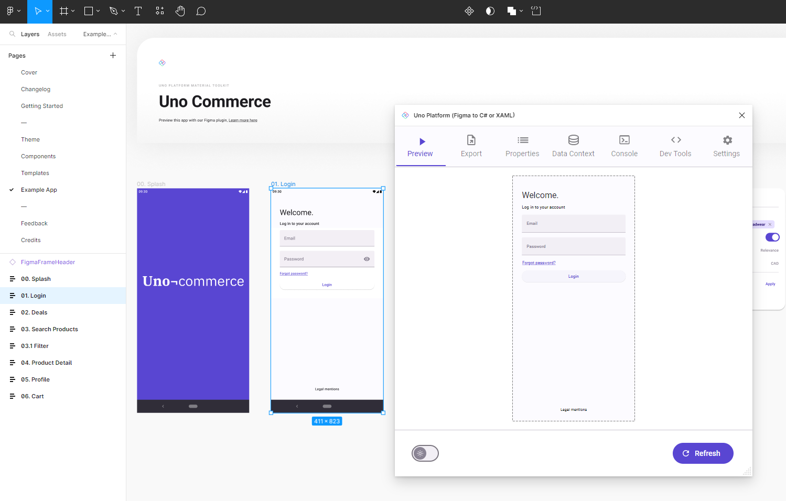

# Get Started

## Design and Build Uno Platform Applications With Figma

Designers can use the highly collaborative Figma environment to fine-tune the User Experience (UX) while putting in place building blocks of an application following the Material Design language.
Using the [Uno Platform Figma Plugin](download.md), it is possible to visualize how the application will render and to export actual XAML for use in Visual Studio for the application. This application is also ready for localization, ready for accessibility, and can optionally make use of [Uno Extensions](https://aka.platform.uno/uno-extensions) (Reactive, Navigation, etc).

## Setup

Ensure that your Figma and development environments are properly setup by following the [Setup](get-started/setup.md) guide. This guide will walk you through the process of installing and configuring everything you need to get started.

## Design to Code

Head first into the [Design to Code](get-started/design-to-code.md) guide to generate your first code (XAML or C# markup) using the Uno Platform Figma Plugin.

## Create an App

Once your environment is setup, you can create your first app by following the [Create an App](get-started/create-an-app.md) guide. This guide will walk you through the process of creating a new app from scratch using XAML code generated by the Uno Platform Figma Plugin.
