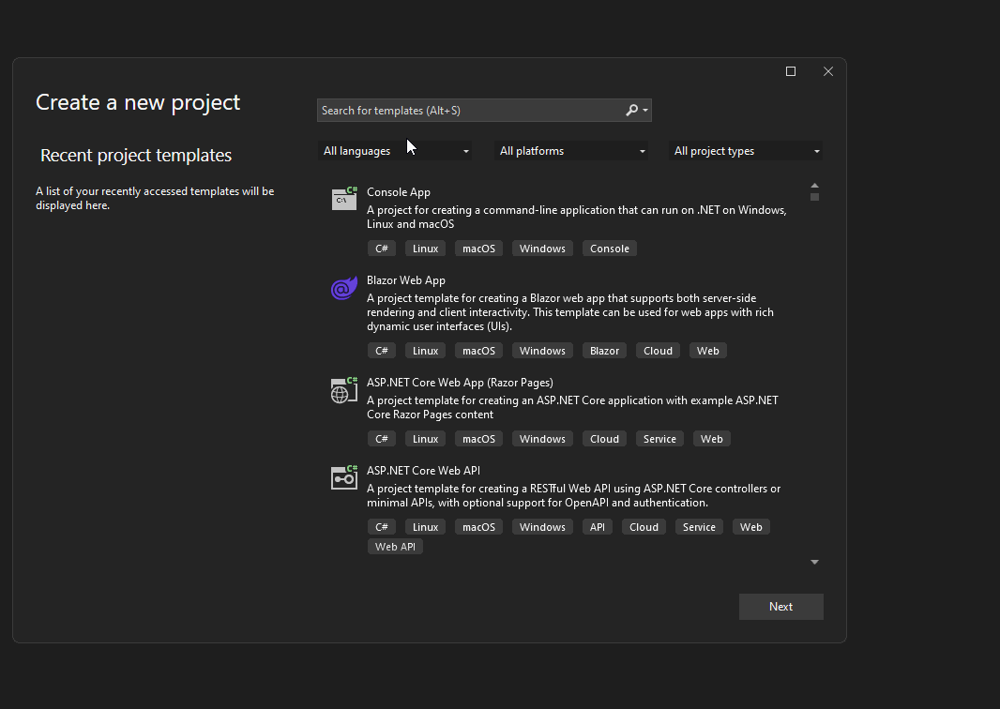
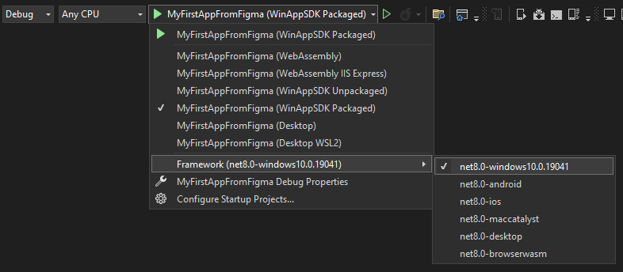

# Create an app

This section will guide you through the process of creating a new app using the Uno Platform Figma Plugin and the _Example App_ present by default in the [Uno Platform Material Toolkit](https://aka.platform.uno/uno-figma-material-toolkit) file, using the [Uno Platform Figma Plugin](https://aka.platform.uno/uno-figma-plugin).

> [!IMPORTANT]
> This page is assuming that the [Design to Code](design-to-code.md) section has been completed.

## Development environment (Visual Studio or your favorite IDE)

Creating a new project using the Uno Platform requires a developer environment to be setup. For more information about setting up your development environment, see [Get Started with Uno Platform](xref:Uno.GetStarted).

## Create a project

This simple tutorial will create a new project using the `unoapp` template. It uses the blank template augmented with Uno Material, Uno Toolkit, MVUX, and Navigation using the XAML UI language.

### [dotnet new](#tab/dotnet-cli)

Run the following command in a terminal to create a new project:

```dotnetcli
dotnet new unoapp -preset blank -theme "material" -presentation "mvux" -di -nav "regions" -toolkit true -o MyFirstAppFromFigma
```

### [Visual Studio](#tab/visual-studio)

1. Open Visual Studio
2. Select _Create a new project_
3. Search for _Uno Platform App_ in the search box and select it
4. Click _Next_
5. Fill the project name (name it `MyFirstAppFromFigma` to fit the rest of this tutorial)
6. Click _Create_
7. The _Uno Platform Template Wizard_ will open
8. Select the _Blank_ template preset
9. Go in the _Presentation_ section and select _MVUX_
10. Go in the _Theme_ section and select _Material_
11. Go in the _Extensions_ section and select _Dependency Injection_ and _Regions_ under Navigation
12. Go in the _Features_ section and select _Toolkit_
13. Click _Create_



---

Following steps will use Visual Studio, but any other IDE should work as well with minimal changes.

## Step 1 - Open the solution, compile and run it

1. Open the generated `MyFirstAppFromFigma.sln` solution in your favorite IDE.
2. In the **Debug toolbar**, select your preferred platform as the startup project. For more detailed instructions specific to each platform, refer to the [Debug the App](xref:Uno.GettingStarted.CreateAnApp.VS2022#debug-the-app) documentation.

    
3. Press F5 to run the app and ensure it builds correctly.
4. Locate the page `MainPage.xaml` inside the `Presentation` folder in the `MyFirstAppFromFigma` library project.
5. Compile the project to ensure it builds correctly.
6. Switch to Figma (next section).

## Step 2 - Make Figma generates the right XAML

1. Go back to Figma, in the document you created in the [Design to Code](xref:Uno.Figma.GetStarted.DesignToCode) section.
2. Open the plugin (more details in the [Setup](xref:Uno.Figma.GetStarted.Setup) section)
3. In Figma, select the _01. Login_ frame
4. In the plugin, navigate to the _Properties_ tab
5. In the _Page Name_ field, write `MainPage`
6. Navigate to the _Application_ subtab
7. In the _Application Namespace_ field, write `MyFirstAppFromFigma`
8. In the _Views Sub Namespace_ field, write `Presentation`
9. Go back to the _Export_ tab
10. Click on the _Refresh_ button
11. Now click on the _Copy_ button to copy the generated XAML to the clipboard

## Step 3 - Paste the generated XAML into app project

1. Go back to your IDE (Visual Studio in this example)
2. Replace the content of the `MainPage.xaml` file with the generated XAML, from the clipboard
3. Press F5 to run the app

## Additional notes
Here is another example in this video, demonstrating the use of Figma Plugin Generated C# Markup in an Uno Platform project:
<div style="position: relative; width: 100%; padding-bottom: 56.25%;">
    <iframe
        src="https://www.youtube-nocookie.com/embed/rV4TClFB6iM?si=1NFaViFd7h4w6Tzh"
        title="YouTube video player"
        frameborder="0"
        allow="accelerometer; autoplay; clipboard-write; encrypted-media; gyroscope; picture-in-picture; web-share"
        allowfullscreen
        style="position: absolute; top: 0; left: 0; width: 100%; height: 100%;">
    </iframe>
</div>

For additional content, explore our [Uno Platform for Figma Plugin - Get Started Series] (https://www.youtube.com/playlist?list=PLl_OlDcUya9qcdp4SYlEdccD7tIYgb1re).

## Next steps

This tutorial has shown you how to create a new app using the Uno Platform Figma Plugin and the _Example App_ present in the _Uno Material Toolkit_ Figma document.

Use this documentation to understand how to use the plugin to generate code from your own Figma document.
