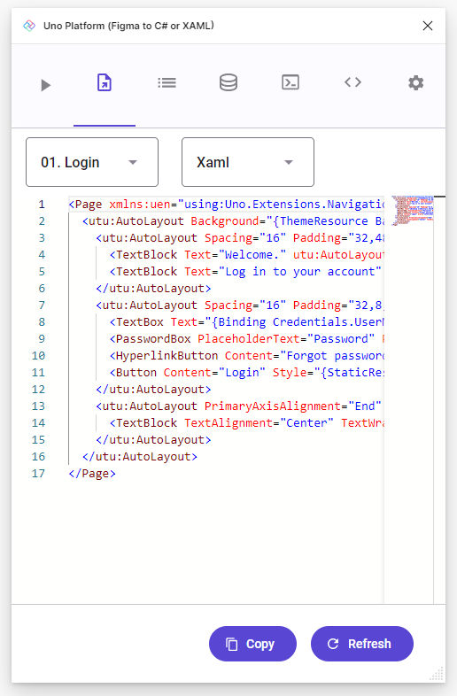

# Design to Code

This section will guide you through the process of generating UI code (XAML or C# Markup) from a Figma document using the [Uno Platform Figma Plugin](https://aka.platform.uno/uno-figma-plugin).

> [!IMPORTANT]
> Is it required to have completed the [Setup](setup.md) section before starting this one.

## Start with a clean copy of the Uno Material Toolkit document

1. Must be in a copy of the _Uno Material Toolkit_ document. If not, follow the [Setup](setup.md) section to create a new copy.
2. Navigate to _Example App_ Figma page

   
3. Locate the _01. Login_ frame, right-click on it and launch the _Uno Platform (Figma to C# or XAML)_ plugin

   

   ... the plugin should launch in the side panel or a module window.
   > [!NOTE]
   > This step assumes the plugin has been closed. If already opened, just select the _01. Login_ frame and continue to the next step.

4. Click the _Refresh_ button to see the selected page in the plugin previewer

   
5. Switch to the _Export_ tab, where the generated XAML is displayed

   
6. Click the _Copy_ button to copy the generated XAML to the clipboard.

   Alternatively, you can also select the XAML and copy it manually.

> [!NOTE]
> This simple tutorial generates XAML code, but it is also possible to generate C# markup instead.
> Click here for more information: [Overview of C# Markup in Uno Platform](xref:Uno.Extensions.Markup.Overview).

## Next step

This tutorial has shown you how to generate code from a Figma document using the Uno Platform Figma Plugin. The next step is to use that generated code in an app by following the [Create an App](create-an-app.md) guide.

The code generated in this section will be used in this next section.

## See also

<!--* [How it works](xref:Uno.Figma.Overview.HowItWorks) - This section explains how the plugin extracts the information from the Figma file and how this information is used to generate the code.-->
* [Setup](setup.md) - This section explains how to setup your environment to use the plugin.
