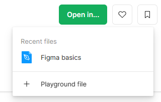
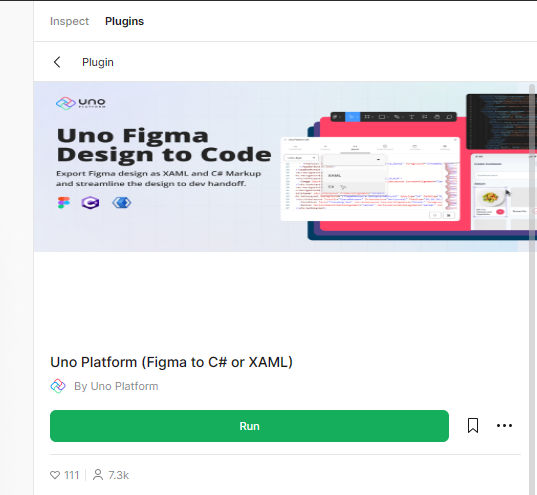

# Setup Uno Platform Figma Plugin

This section will guide you through the process of setting you up to use Figma and the Uno Platform Figma Plugin to generate code that can be used to create an app.

Those steps will use the web version of Figma. The plugin is also available in the desktop version of Figma and the steps are pretty similar.

## Figma Plugin

Let's start by making sure you have a working Figma environment.

1. Navigate to [Figma web site](https://figma.com/)
2. Sign-in or [create a new account](https://help.figma.com/hc/en-us/articles/360039811114-Create-a-Figma-account) if you don't have one already
3. Navigate to the [Uno Figma Plugin page](https://aka.platform.uno/uno-figma-plugin)
4. Click on the _Open in..._ button and pick `+ Playground file` option to create a new copy of the _Uno Material Toolkit_ document

   
5. Figma should launch be default in _developer mode_ (see below if it doesn't)
6. Click on the _Run_ button to launch the plugin

   
7. Your Figma is now ready to start generating code

> [!NOTE]
> There are many ways to launch the plugin. If the provided method doesn't work for you, you can also:
>
> * Press <kbd>shift</kbd>+<kbd>d</kbd> to toggle between _developer mode_ and _design mode_
> * In Design mode: use the _plugin_ menu in the toolbar and search for _Uno Platform_
>
>   
> * In Developer mode: use the _Plugins_ tab in the right panel and search for _Uno Platform_
>
>   

## Next step

Start generating code from a Figma document by following the [Design to Code](design-to-code.md) guide.
