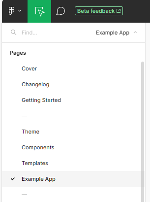
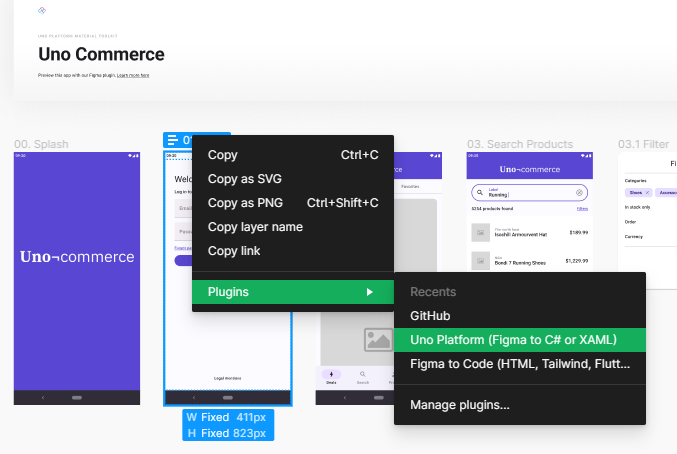
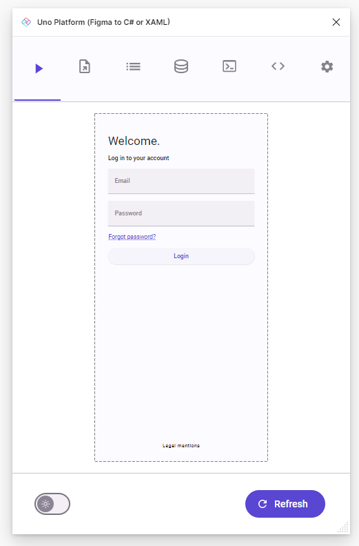
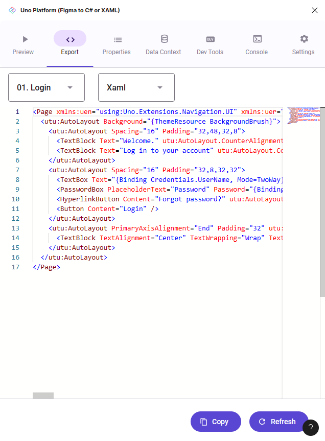

# Design to code

This section will guide you through the process of generating code from a Figma document using the [Uno Platform Figma Plugin](https://aka.platform.uno/uno-figma-plugin).

> [!IMPORTANT]
> Is it required to have completed the [Setup](setup.md) section before starting this one.

## Start with a clean copy of the Uno Material Toolkit document
Let's start by making a clean copy of the _Uno Material Toolkit_ document. If you just did the [Setup](setup.md) section, you should already have a copy of the _Uno Material Toolkit_ document in your Figma account. If not, follow these steps to create a new copy:

1. Navigate to the plugin page [Uno Platform Figma Plugin](https://aka.platform.uno/uno-figma-plugin)
2. Click on the _Open in..._ button
 
   
3. Pick `+ Playground file` option to create a new copy of the _Uno Material Toolkit_ document
4. Figma should launch be default in _developer mode_. If it doesn't, press <kbd>shift</kbd>+<kbd>d</kbd> to toggle between _developer mode_ and _design mode_
5. Navigate to _Example App_ Figma page

   
6. Locate the _01. Login_ frame, right-click on it and launch the _Uno Platform (Figma to C# or XAML)_ plugin

   

   ... the plugin should launch in the side panel. 
7. Click the _Refresh_ button to see the selected page in the plugin previewer

   
8. Now switch to the _Export_ tab, where the generated XAML is displayed

   
9. Click the _Copy_ button to copy the generated XAML to the clipboard.

   Alternatively, you can also select the XAML and copy it manually.

## Next step

This tutorial has shown you how to generate code from a Figma document using the Uno Platform Figma Plugin. The next step is to use that generated code in an app by following the [Create an App](create-an-app.md) guide.

The code generated in this section will be used in this next section.

## See also

* [How it works](xref:Uno.Figma.Overview.HowItWorks) - This section explains how the plugin extracts the information from the Figma file and how this information is used to generate the code.
* [Setup](setup.md) - This section explains how to setup your environment to use the plugin.