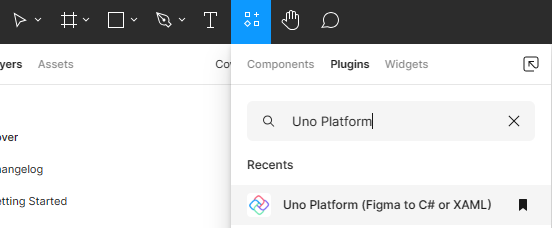
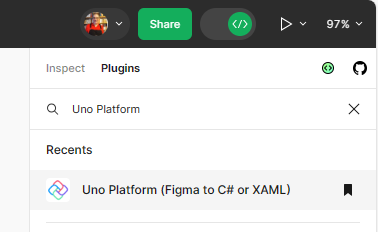

# Setting up your environment

## Figma environment
Let's start by making sure you have a working Figma environment.

1. Navigate to [Figma web site](https://figma.com/)
2. Sing-in or [create a new account](https://help.figma.com/hc/en-us/articles/360039811114-Create-a-Figma-account) if you don't have one already
3. Navigate to the [Uno Figma Plugin page](https://aka.platform.uno/uno-figma-plugin)
4. Click on the _Open in..._ button and pick `+ Playground file` option to create a new copy of the _Uno Material Toolkit_ document

   
5. Figma should launch be default in _developer mode_ (see below if it doesn't)
6. Click on the _Run_ button to launch the plugin

   
7. Your Figma is now ready to start generating code

> [!NOTE]
> There is many ways to launch the plugin. If the provided method doesn't work for you, you can also:
> * Press <kbd>shift</kbd>+<kbd>d</kbd> to toggle between _developer mode_ and _design mode_
> * In Design mode: use the _plugin_ menu in the toolbar and search for _Uno Platform_
>
>    
> * In Developer mode: use the _Plugins_ tab in the right panel and search for _Uno Platform_
>
>    

## Development environment

Creating a new project using the Uno Platform requires a developer environment to be setup. The following guides will help you setup your environment:

> [!IMPORTANT]
> Ensure you have a working development environment before continuing.
> Follow the [Uno Platform Getting Started](xref:Uno.GetStarted) guide.
> This guide will use Visual Studio on Windows as the IDE, but it is possible to use other supported IDEs like Visual Studio Code or JetBrains Rider.

## Next step

Start generating code from a Figma document by following the [Design to Code](design-to-code.md) guide.