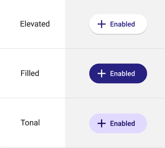
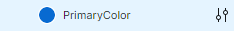
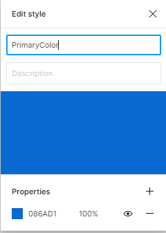
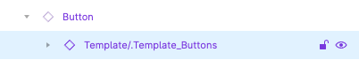
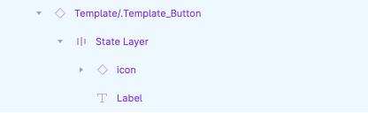

# Colors in Uno Figma Platform Material Toolkit (UFPMT)

[!Video https://www.youtube-nocookie.com/embed/MWI3lPD5M2k]

## Mastering Color Styles in UFPMT

### Introduction to Semantic Color Styles

The Uno Figma Platform Material Toolkit (UFPMT) comes preloaded with a collection of semantic color styles. These styles facilitate the application of project-specific colors across all components in the design system. Understanding and customizing these styles is key to ensuring a cohesive and visually appealing design.

> [!CAUTION]
> Colors applied outside the predefined color styles in UFPMT will not be reflected in the XAML generated by the plugin. Adherence to these styles is crucial for consistency in design and code.

## Global Color Application

### Steps to Apply Colors Globally

1. **No Selection**: Start with no elements selected in the *Color Styles* panel.
2. **Edit Style**: Right-click on a color and choose 'Edit Style', or hover and click the appearing icon.

   

3. **HEX Code Selection**: Pick the desired HEX code in the *Properties* section and close all panels to apply the change.

   

> [!TIP]
> Adjusting global colors at the start of your design process is recommended, though they can be altered at any stage.
>
> [!CAUTION]
> Modifying colors with an element selected in Figma will only affect that specific element and not the entire document. Such changes will not carry over to the XAML export.

## Component-Specific Color Application

### Steps to Apply Color to Individual Components

1. **Select the Component**: From the *Layers* panel, select and expand the desired component.
2. **Focus on Template Layer**: Edit the `◇ Template/.Templst_[component name]*` layer.
3. **Adjust Colors**: Use the *Color Selection* panel to choose and edit the color style.

   

> [!NOTE]
> Top layers of components cannot be directly colored.

## Modifying Colors for Component States

### Steps for State Color Changes

1. **Select Component and State Layer**: Focus on the component and its associated state layer.
2. **Update Colors**: Edit colors for both the `State Layer` and `◇ Template/.Templst_[component name]`.

   

> [!NOTE]
> UFPMT's plugin generates code only for color styles with a `*Color*` suffix. `*brush*` suffixed styles require manual handling.

## Creating and Using Custom Colors

Enhance your design with custom colors for a unique and consistent branding experience. Learn how to create and apply these colors within UFPMT through our guides.

- Detailed Documentation: [Custom Colors for Developers](../developers/custom-colors.md)
