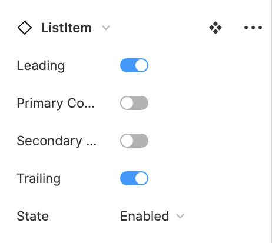
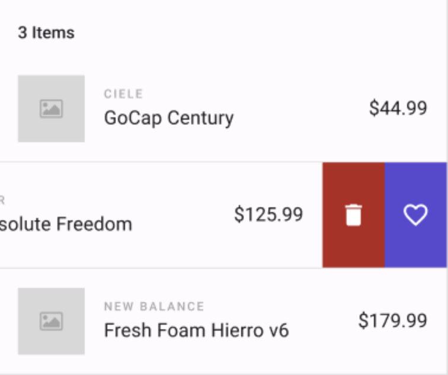

# How to use Lists

## Overview

When the design requires a dynamic list (lists populated with data returned by an API), use this component: **List: Template**. It can be found in the *Assets* section of the Toolkit. If the list you need is a static set of elements, build it using components like *Button* and/or *Text Block*.

### Steps

1. Place *List Template* inside the `◇ Content Scrollable` layer of the page template;
2. With the list selected, right-click and select "Detach instance" from the contextual menu 
3. Choose the ListItem variants required for your list
4. Set list-related settings in the Uno Plugin. (See below)

List are composed of *ListItems*. *ListItems* have many variants to choose from: Leading Items, Content, Primary Controls, Secondary Controls, or Trailing items. Each of those also has variants of their own e.g. Leading Item can be either: Image, Person Picture or Icon.
>[!NOTE]
>Lists do not include space between ListItems. If the design requires space between items, add a padding at the top or bottom of your ListItem component.

## Uno Plugin Settings for Lists

To render properly, List requires specific settings to be enabled in the plugin:

1. Select the *List Template* component in the layout;
2. Launch plugin;
3. From the *Properties* tab of the plugin (first from the left) select *Layout type* and set it to *Scrollable* then click the *Save* button (bottom left);
4. From the *Settings* Tab (far right), toggle *Binding* to *On* and click the *Save* button (scroll all the way down to find it).
5. Return to the *Preview* Tab (Second from the left) and click the *refresh* button to render the results.

>[!NOTE]
>Only the first item (usually a *List Item*) at the top of the list will be used to create the template in the generated XAML output by the Uno Plugin.

### Lists with Swipeable Content

To add swipeable lists to an app, use the **Swipe Control list: Template** found in the assets panel. Any number of items can be added to the list by duplicating the `◇ SwipeControl` and `◇ Divider` layers found within the component.

### Steps

1. Place *Swipe Control List: Template* inside the *Content Scrollable* layer of the page template;
2. Choose the SwipeControl variants required for your list;
3. Go to the *Prototype tab* found in the top right of the Figma interface
4. Select the *Overflow scrolling* then select one of the 4 available options :
   - No scrolling
   - Horizontal scrolling
   - Vertical scrolling
   - Horizontal and vertical scrolling

### Uno Plugin Properties for Swipeable Lists

To render properly, Swipeable List requires specific settings to be enabled in the plugin:

1. Start after **Step 2** of the previous section
2. Select *Swipe Control List: Template* component in the layout;
3. Launch plugin;
4. From the [*Properties* tab](../developers/properties-tab.md) of the plugin (first from the left) select *Layout type* and set it to either *Default or Scrollable* then click the *Save* button (bottom left);
5. Return to the *Preview* Tab (second from the left) and click the *refresh* button to render the results.
