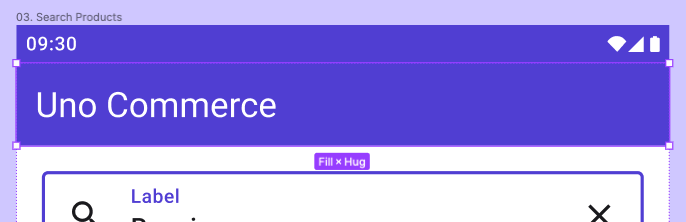
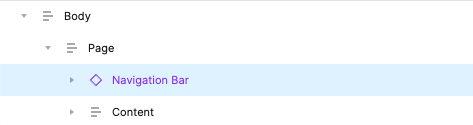

# How to Use the NavigationBar Component

## Overview

Navigation Bars are typical UI elements found at the top of the screen in most mobile applications. They primarily enable navigation, help orient users, support brand/app recognition, and can also house contextual actions.

## Guidelines

* The `NavigationBar` component should be placed within the *Page* layer and outside of the *Content* layer in your Figma document.

* `Background` fill colors may only be set to *Surface* or *Primary* colors at the moment. Use the corresponding styles found in the variants panel.

* Leading icons are not currently rendered in the Uno plugin. The generated XAML will correctly invoke a native NavigationBar with a leading icon when exported to your project.

* For this specific component only: generate pixel-based assets for any icons used in the NavigationBar, for both light and dark themes, in all supported pixel densities of your project. Refer to “How to export image assets for the Uno platform?” in the *Theme* page of the Uno Toolkit Figma file.

## Toolkit Variants

Type: Default or Modal
Trailing icons: True or False
Style: Primary or Surface
