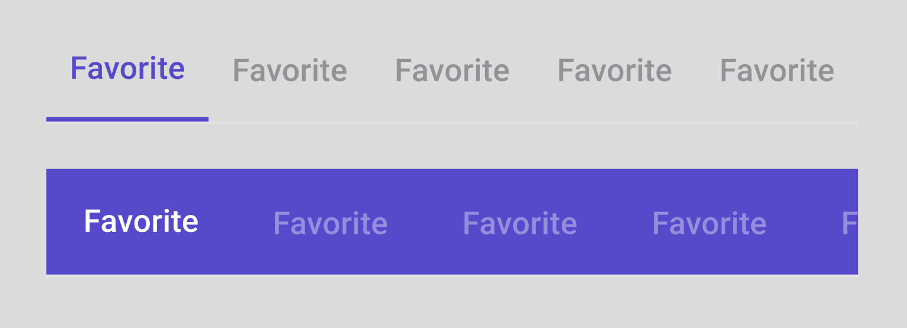

# How to use Tabs component 

## Overview

Tabs help the organization of content and data sets. Tabs components can host from 1 to 5 TabBarItems. Tabs can either have a fixed width in which to display all its items or it can scroll its TabBarItems horizontally.

Tabs can be found in the *Assets* panel in the *Navigation* group of components.

## Steps

1. Drag *Tabs* component into the `Page` layer of the design (as tabs aren’t part of the scrollable content of a page);
2. Select the amount of *TabBarItems* as well as their behaviour (Fixed or Scrollable) from the *variants* panel;
3. Text and Icon options can be managed by selecting the `◇ TabBarItem` layers to reveal their distinctive variants in the Figma Variants panel.

## Styling Tabs

Tabs can be styled as either Top Tabs or Bottom Tabs

When applying color to tabs there are 2 patterns that can be used:

1. Transparent surface with `PrimaryColor` for the selected `TabBarItem` content and OnSurface @ 38% opacity for unselected `TabBarItem` content;
2. Filled surface with `PrimaryColor`, with `OnPrimaryColor` for the selected `TabBarItem` content and `OnPrimaryColor` @ 38% opacity for unselected `TabBarItem` content.

## Tab Variants

Item count: 1, 2, 3, 4, 5

Scrollable or Fixed

#### TabBarItem

Text: True or False

Icon: Top, Only, Side, None