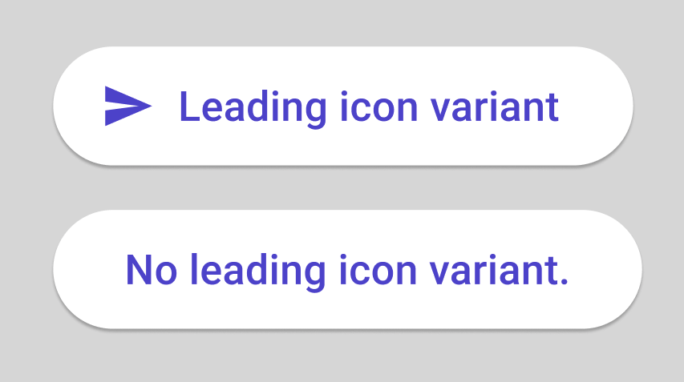
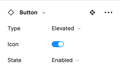

# How to Use Components

## Overview

Components are elements you can reuse across your designs. They help to create and manage consistent designs across projects and produce optimal XAML output. Uno toolkit comes with a huge library of ready to use components. You can see them all at once in the *Components* page of the Figma Uno Toolkit. Component instances have a `◇ (Diamond icon)` before their names in the *Layers* pane.

Once a component is brought into a design page it becomes an **Instance** of it’s **Main Component**. Instances can be individually edited without affecting each other, while editing a *Main Component* will propagate changes across all of it's instances.

Most Toolkit Components have **Variants**. Variants are very powerful time savers as they allow a single component to house various states and variations with specific attributes that the user may toggle on and off. e.g.: buttons components have a Leading Icon variant so you can use the same element with or without icons throughout the design.

All variants are children of a *Main Component* and all of those *Main Components* are children of a **Component Template**. Editing a *Component Template* will update all of it’s *Main Components* but none of their instances. Templates have a ❖(4 Diamonds icon) before their name in the *Layers* pane.

## General Guidelines

- Never detach a component instance from it’s main component to ensure proper XAML generation from the UNO plugin
- Avoid editing the Component Templates from the Components Page, this may have unintended consequences on your design and the XAML output.

### Steps to add components to your design

1. Click on the page used for your design;
2. Open the *Assets* Tab at the top of the *Layers* pane;
3. Expand *Local Components;*
4. Drag* the desired component into the canvas
5. Select desired variant from the Figma Design panel on the left of your monitor

*Drag, don’t click. Clicking the component will bring you to the Components page and you will have to navigate back to your design page.**Overview**
