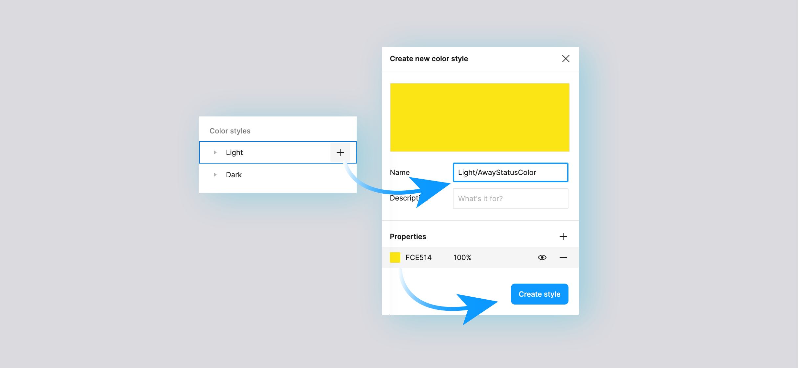

# Using Custom Colors

## What are custom color styles, and why use them?

Custom colors allow you to add Colors Styles to those already provided by the Uno Figma Material Toolkit. This added functionality can be used to:

* Add new color styles to both the Light and Dark themes;
* Create a "fixed" color style for your design displaying the same HEX value in both Light and Dark themes.

You may want to do this in your app to: denote statuses, add color tags, add more accent colors, or even support custom vector illustrations. While we encourage you to stick to the color roles provided by the Material design system we know that sometimes primary, secondary, and tertiary accent colors just aren't enough to cover all use cases, so we introduced Custom Color Styles. 

> [!NOTE]
> Adding a new color style will not generate any associated styles. For example, adding a new custom style named "AwayStatusColor" would not automatocally generate a Dark theme equivalent, nor generate: "OnAwayStatusColor", "AwayStatusColorcontainer", "OnAwayStatusColorContainer", that your project may or may not need.

## How to add a custom color style 

1) From the [Uno Figma Toolkit file](https://www.figma.com/community/file/1110792522046146058) make sure you have nothing selected;
2) Go to the *Design* panel on the right side of the screen, find the *Color style* section, and hover over the "Light" theme;
3) Click the ➕ icon to add a custom color style to the Light theme
4) Name your color, pick a value, and click Create Style
5) Optional: If you want your new style to have a Dark theme counterpart repeat the above steps but select the "Dark" theme in step 2, and use the same name for both custom styles.

> [!IMPORTANT]
> Custom colors name **MUST ENDS WITH `Color`**.