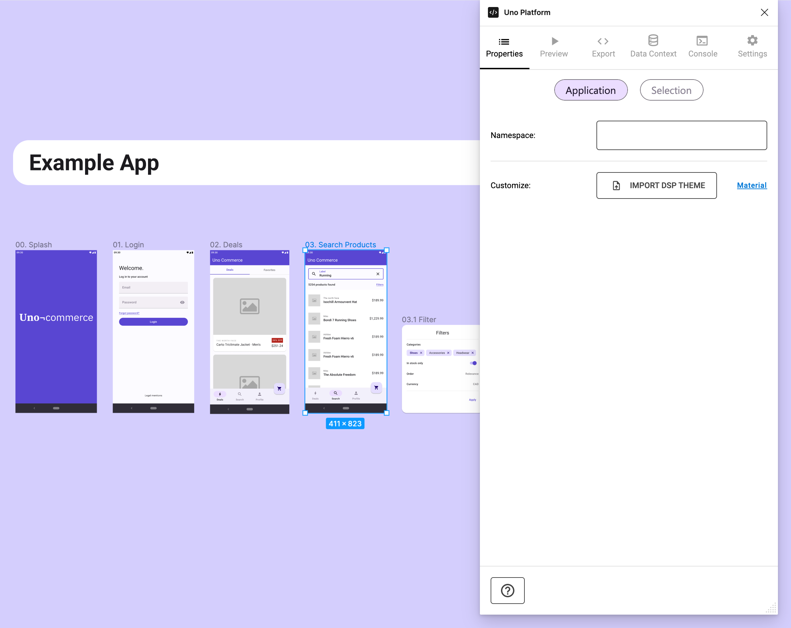
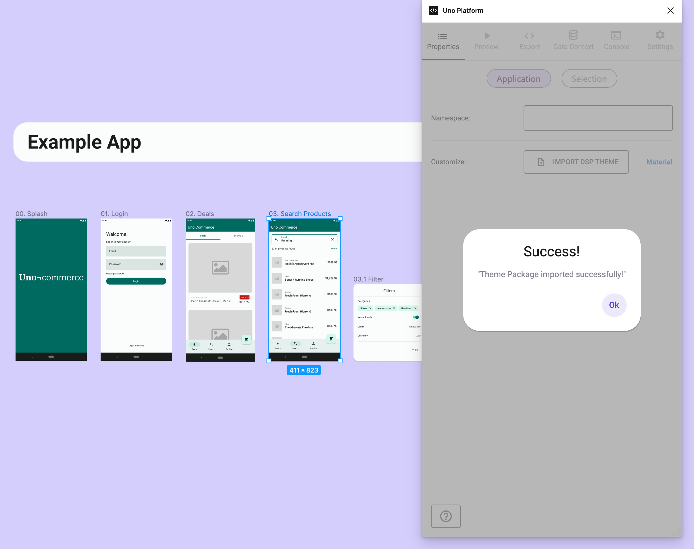

# Importing a Uno DSP Color Theme

Supports Uno DSP files from the web version of the Material Theme Builder.

## What is Uno DSP, and Why Use It?
Uno DSP is an "*open-format created to help teams share design system information across tools.*"

The Uno plugin for Figma allows you to import a DSP file generated from the online version of the [Material Theme Builder](https://aka.platform.uno/uno-material-themebuilder). This provides a shortcut to exploring and applying different color themes for your app design. Once imported into the Uno Figma Toolkit, all its components will update to follow your new color theme, saving you time and effort.

We recommend doing this at the start of the design phase, but you can apply a new theme to your design at any point in the design cycle.

> [!IMPORTANT]
> Due to Figma restrictions, we can't import a Uno DSP file in Figma Developer Mode. The feature will only be available when the plugin is running in Design Mode.

## How to Import the DSP File

1. Generate your color theme from the [Material Theme Builder](https://aka.platform.uno/uno-material-themebuilder).
1. Click the *Export* button in the top right area of the website and make sure to select **Material Theme (JSON)** from the dropdown menu.
1. From the [Uno Figma Toolkit file](https://aka.platform.uno/uno-figma-material-toolkit), select a page from your design and launch the [Uno Figma plugin](https://aka.platform.uno/uno-figma-plugin).
1. Go to the *Properties* Tab, select *Application*, and click *Import DSP Theme*.
1. From the file picker window, navigate to the location of the *material-theme.json* file you exported in step 2.

> [!IMPORTANT]
> Brushes will not be automatically updated when importing a Uno DSP file. Make sure to update the brushes in Figma to match the new colors they are based on.

## After Uno DSP Import

