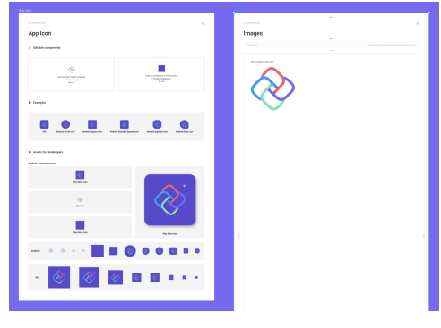
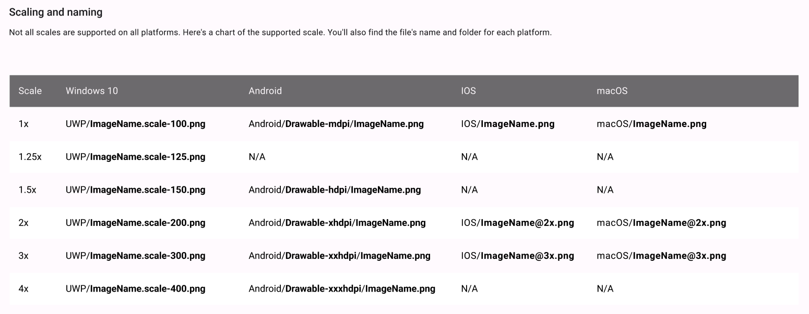
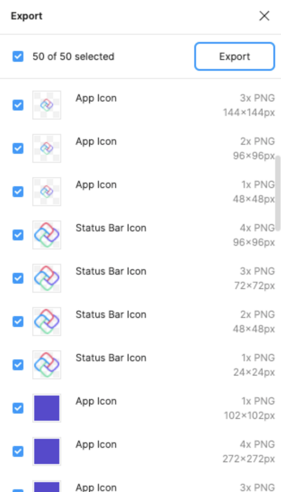

# How to Export Assets

## Overview

Toolkit now includes handy *App Icon* and *Image* asset exporting templates. These templates are preset to generate all necessary sizes for cross-platform projects. Those templates can be found on the *Theme* page of the Uno Figma Toolkit.

## Guidelines

- Android app icons include background resources. These do not display a logo and should be left as such.
- The Uno NavigationBar component currently requires the generation of image assets for any icons you choose to use within it.
- If you have multiple color themes in your project, like Light and Dark, generate image assets required for each of these where necessary.
- Not all scales are supported for every platform so it could be required to generate some extra assets manually.

### Steps generate App Icons

1. Go to the *Theme* page from the Figma *Page* pane;
2. Go to the App Icon layout;
3. Delete the Uno placeholder logo in first *Editable Component* at the top of the page where it says "Insert your logo into this component";
4. Paste the logo into the component. This should update all the app icons below;
5. In the Background Frame select the “*Edit me*” layer;
6. From the Figma Design pane on the right of the screen, update the app Icon’s background color. This should update all app icons below;
7. Select the entire *App Icon* layout;
8. From the file menu select *Export*;
9. From the Export panel review and click *Export*;
10. From the file browser window select the disk location to save the assets

### Steps generate other image assets

1. Go to the *Theme* page from the Figma Page pane;
2. Go to the Images layout;
3. Delete the Uno placeholder logo in the layout where it says “Insert your images into this component”;
4. Paste all images into the “Images” frame;
5. Select the entire "Images" layout;
6. From the file menu select "Export";
7. From the Export panel review and click "Export";
8. From the file browser window select the disk location to save assets. The proper folder structure will be generated to house all asset resolutions.

