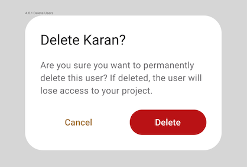

# How to Use Instance Overrides

## Overview

The Uno Figma Platform Material Toolkit (UFPMT) includes a set of components designed and styled to closely follow [Material 3 color guidelines](https://aka.platform.uno/uno-material-m3-colors). Designers using UFPMT should be intimately familiar with the Material color system before attempting to substitute color roles throughout components, or they may encounter issues in the XAML generated from their compositions. UFPMT's *Instance Overrides* feature provides more control and flexibility in areas like swapping color roles and managing component borders (strokes in Figma parlance). Overrides also allow for the redefinition of corner radius values in Uno Toolkit components.

## How It Works

Instance overrides work by detecting changes between a component's Editable Template and its instances used in your Figma design file. When you use the Uno Figma Plugin to generate XAML or a Preview of a selected composition, any overrides applied to button instances, such as a new style for a red destructive change confirmation button, will be recognized by the plugin and reflected in the generated XAML.

## Instance Overrides Per Component

Foreground color usually refers to the content (in Material guidelines) of a component like text and icons, as well as state overlays. Background color is usually the fill color used to define the shape of the component. Border is synonymous with stroke (in Figma) and outline (in Material) and is a line defining the outer border of a component.

### [Button](../../components/button.md)

| Property         | Currently supported instance overrides                       | Edit this Layer in Figma  |
| ---------------- | ------------------------------------------------------------ | ------------------------- |
| Background color | Swap Primary and Surface fill colors with other color roles from the toolkit. | Main (Top) frame               |
| Foreground color | Swap any colors roles assigned to button labels and icons with other color roles from the toolkit. | Label, Vector             |
| Border           | Swap button border (aka Stroke) colors with other color roles from the toolkit. Add, remove and edit border thickness from instances. | Main (Top) frame  |
| Content Alignment | Define custom content alignment (horizontal, and vertical) values. | Main (Top) frame  |
| Corner radius    | Define custom corner radius values. | Main (Top) frame  |

### [Card](../../components/card.md)

| Property         | Currently supported instance overrides                       | Edit this layer in Figma   |
| ---------------- | ------------------------------------------------------------ | ------------------------------- |
| Background color | Swap fill colors with any other color roles from the toolkit. | Main (Top) frame               |
| Foreground color | Swap any colors roles assigned to content with other color roles from the toolkit. | Main (Top) frame               |
| Border           | **Only for Outlined variants** Swap card border (aka Stroke) colors with other color roles from the toolkit. Add, remove and edit border thickness from instances. | Main (Top) frame  |
| Corner radius    | Define custom corner radius values. | Main (Top) frame  |

### [Chip](../../components/chip.md)

| Property          | Currently supported instance overrides                       | Edit this layer in Figma |
| ---------------- | ------------------------------------------------------------ | ------------------------ |
| Background color | Swap fill color role with any other color roles from the toolkit. | Main (Top) frame                |
| Foreground color | Swap color roles used for text and icons with any other color roles from the toolkit. | Text, Vector             |
| Border           | Add, remove and edit border thickness from instances. Use any color role from the Toolkit. | Main (Top) frame                |

### [Check Box](../../components/check-box.md)

| Property         | Currently supported instance overrides                       | Edit this layer in Figma |
| ---------------- | ------------------------------------------------------------ | ------------------------ |
| Content Foreground color | Swap CheckBox Label color role with other color roles from the toolkit. | Template/Content/Content                    |
| Foreground color | Swap color roles used for check container with any other color roles from the toolkit. | Template/Content/Selected/OutlinePath             |

### [Combo Box](../../components/combo-box.md)

| Property         | Currently supported instance overrides                       | Edit this layer in Figma |
| ---------------- | ------------------------------------------------------------ | ------------------------ |
| Background color | Swap ComboBox Surface color role with other color roles from the toolkit. | Input                    |
| Foreground color | Swap OnSurface color role used for text and icons with other color roles from the toolkit. | Text, Vector             |
| Border           | Swap ComboBox border (aka Stroke) colors with other color roles from the toolkit. Add, remove and edit border thickness from instances. | Input                    |

### [Divider](../../components/divider.md)

| Property         | Currently supported instance overrides                       | Edit this layer in Figma   |
| ---------------- | ------------------------------------------------------------ | -------------------------- |
| Foreground color | Swap fill color role used for dividers with any other color roles from the toolkit. | Template/.Template_Divider |

### [Floating Action Button (FAB)](../../components/fab.md)

| Property                     | Currently supported instance overrides                       | Edit this layer in Figma  |
| ---------------------------- | ------------------------------------------------------------ | ------------------------- |
| Background color             | Swap PrimaryContainer fill color with other color roles from the toolkit. | Main (Top) frame    |
| Foreground color             | Swap any colors roles assigned to FAB labels and icons with other color roles from the toolkit. | Label, Vector             |
| Border                       | Swap FAB border (aka Stroke) colors with other color roles from the toolkit. Add, remove and edit border thickness from instances. | Main (Top) frame |
| Corner Radius  | Define custom corner radius values for border and/or background color. | Main (Top) frame  |

### [Hyperlink](../../components/hyperlink-button.md)

| Property         | Currently supported instance overrides                       | Edit this layer in Figma |
| ---------------- | ------------------------------------------------------------ | ------------------------ |
| Background color | Add a fill color with color color roles from the toolkit.    | Hyperlink Button         |
| Foreground color | Swap Primary or OnSurface color role used for hyperlinks with any other color roles from the toolkit. | Link                     |
| Border           | Add, remove and edit border thickness from instances. You can assign any toolkit color to the border property. | Hyperlink Button         |

### [Icon Button](../../components/icon-button.md)

| Property         | Currently supported instance overrides                       | Edit this layer in Figma        |
| ---------------- | ------------------------------------------------------------ | ------------------------------- |
| Background color | Add and edit a background fill to instances.                 | Main (Top) frame                |
| Foreground color | Swap any colors roles assigned to ToggleButton icons with other color roles from the toolkit. | Vector (checked and unchecked)* |
| Border  | Add button border (aka Stroke) colors from the toolkit. Add and edit border thickness to instances. | Main (Top) frame  |
| Corner Radius  | Define custom corner radius values for border and/or background color. | Main (Top) frame  |

### [Icon Toggle Button](../../components/icon-toggle-button.md)

| Property         | Currently supported instance overrides                       | Edit this layer in Figma        |
| ---------------- | ------------------------------------------------------------ | ------------------------------- |
| Background color | Add and edit a background fill to instances.                 | Main (Top) frame                |
| Foreground color | Swap any colors roles assigned to ToggleButton icons with other color roles from the toolkit. | Vector (checked and unchecked)* |
| Border  | Add button border (aka Stroke) colors from the toolkit. Add and edit border thickness to instances. | Main (Top) frame  |
| Corner Radius  | Define custom corner radius values for border and/or background color. | Main (Top) frame  |

### [Navigation Bar](../../components/navigation-bar.md)

| Property         | Currently supported instance overrides                       | Edit this layer in Figma        |
| ---------------- | ------------------------------------------------------------ | ------------------------------- |
| Background color | Add and edit a background fill to instances.                 | Main (Top) frame                |
| Foreground color | Swap any colors roles assigned to Text Content.              | Bar/Content/Text                |
| Icon Foreground color | Swap color roles assigned to any icon with any other color roles from the toolkit. | Respective Vector             |

### [Password Box](../../components/password-box.md)

| Property      | Currently supported instance overrides                       | Edit this layer in Figma |
| ---------------- | ------------------------------------------------------------ | ------------------------ |
| Background color | Swap fill the color role with any other color roles from the toolkit. | Main (Top) frame  |
| Corner Radius    | Define custom corner radius values for border and/or background color. | Main (Top) frame  |
| Foreground color | Swap color roles used for text and icons with any other color roles from the toolkit. | Text, Vector             |
| Border           | Add, remove and edit border thickness from instances. Use any color role from the Toolkit. | Main (Top) frame  |

### [Pips Pager](../../components/pips-pager.md)

| Property      | Currently supported instance overrides                       | Edit this layer in Figma |
| ---------------- | ------------------------------------------------------------ | ------------------------ |
| Background color | Swap fill color role with any other color roles from the toolkit. | Main (Top) frame                |

### [Radio Button](../../components/radio-button.md)

| Property         | Currently supported instance overrides                       | Edit this layer in Figma |
| ---------------- | ------------------------------------------------------------ | ------------------------ |
| Background color | Swap RadioButton Primary color role with other color roles from the toolkit. | Icon, Color              |
| Foreground color | Swap OnSurface color role used for text label with other color roles from the toolkit. | Content                  |
| Border           | Add, remove and edit border thickness from instances. Use any color role from the Toolkit. | RadioButton              |

### [Slider](../../components/slider.md)

| Property           | Currently supported instance overrides                       | Edit this layer in Figma |
| ---------------- | ------------------------------------------------------------ | ------------------------ |
| Background color | Swap Slider Primary color role with other color roles from the toolkit. | Inactive track           |
| Foreground color | Swap OnSurface color role used for text label with other color roles from the toolkit. | Color                   |
| Border           | Add, remove and edit border thickness from instances. Use any color role from the Toolkit. | RadioButton              |

### [Text Box](../../components/text-box.md)

| Property          | Currently supported instance overrides                       | Edit this layer in Figma |
| ---------------- | ------------------------------------------------------------ | ------------------------ |
| Background color | Swap fill the color role with any other color roles from the toolkit. | Main (Top) frame  |
| Corner Radius    | Define custom corner radius values for border and/or background color. | Main (Top) frame  |
| Foreground color | Swap color roles used for text and icons with any other color roles from the toolkit. | Text, Vector             |
| Placeholder Foreground color | Swap color roles used for placeholder/label with any other color roles from the toolkit. | Label             |
| Padding           | Define custom padding values for the control, affecting its content. | Input                    |
| Border           | Add, remove and edit border thickness from instances. Use any color role from the Toolkit. | Main (Top) frame  |
| ContentAlignment | Define custom alignment for its content. | Input text  |

### [Tab Bar (Navigaton variant only)](../../components/tab-bar.md)

| Property          | Currently supported instance overrides                       | Edit this layer in Figma |
| ---------------- | ------------------------------------------------------------ | ------------------------ |
| Background color | Swap fill color role with any other color roles from the toolkit. | Main (Top) frame                |
| Foreground color | Swap color roles used for text and icons with any other color roles from the toolkit. | Text, Vector             |
| Border           | Add, remove and edit border thickness from instances. Use any color role from the Toolkit. | Main (Top) frame                |

## **Controls with No Support**

The following controls do not support overrides at this time:

* DatePicker
* Dialogs
* Flyouts
* ListItem
* Progress Bar
* RatingControl
* SwipeControl
* TabBar* (Content variants and activity indicators are unsupported)
* ToggleSwitch*
