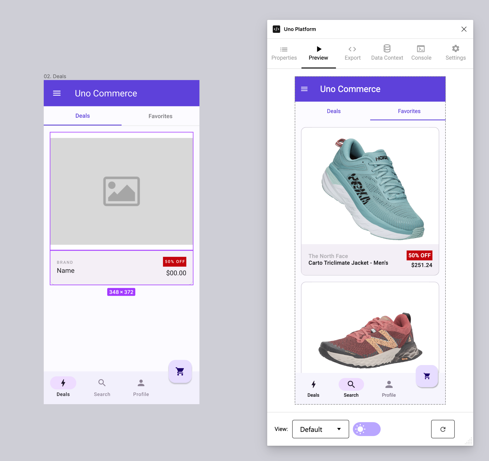

# Maximizing UI Design with ItemsRepeater in Uno Figma

## Understanding the ItemsRepeater

ItemsRepeater is an advanced feature in the Uno Figma Toolkit designed to generate code for displaying collections of items in various layouts, like lists and grids. It's particularly efficient for large datasets, improving app performance by rendering items in a repeating pattern, thereby reducing memory usage. This feature not only benefits developers but also streamlines the design-to-development handoff process.

## Choosing Between UniformGridLayout and StackLayout

- **UniformGridLayout**: Presents items in a uniform-sized grid, ideal for visually organized displays.
- **StackLayout**: Stacks items either horizontally or vertically, based on AutoLayout properties, suitable for linear item arrangements.

## Implementing Scrolling with ItemsRepeater

It's important to note that ItemsRepeater itself doesn't provide scrolling capabilities. To incorporate scrolling, place the ItemsRepeater within a scrollable region. It will then adapt its virtualization to the scroll viewers present.

## Steps to Apply ItemsRepeater in Figma Designs

### 1. **Frame Selection**

- Choose the frame where the repeated items will be displayed.

### 2. **Launch Uno Plugin**

- Open the Uno Figma plugin to begin customization.

### 3. **Configure Properties**

- In the *Properties* Tab, select **ItemsRepeater** from the *Type* dropdown menu.

### 4. **Setting Up Data Context**

- Navigate to the *Data Context* Tab.
- Enter your data in JSON format to simulate real-world content.
- Save your settings.

### 5. **Previewing Your Design**

- Use the *Preview* Tab to refresh and see the updated layout.
- The live preview will display the layout populated with data from the Data Context tab.



> [!NOTE]
> The ItemsRepeater doesn't provide states for the repeated items. Data Context is set at the *Root Frame* level in Figma, meaning the data will be associated with the first *root* frame, regardless of the selected element.

### Example of Data Context

Below is an example JSON data, featuring a variety of products:

``` json
{
  "Items": [
    {
      "Name": "Alpine Trek Jacket - Men's",
      "Brand": "Mountain Peak",
      "Photo": "https://nv-assets.azurewebsites.net/tests/commerce/products/product1.png",
      "DiscountedPrice": "$200.99",
      "Discount": "40% OFF"
    },
    {
      "Name": "Velocity Sprinter Shoes",
      "Brand": "RunFast Gear",
      "Photo": "https://nv-assets.azurewebsites.net/tests/commerce/products/product2.png",
      "DiscountedPrice": "$120.49",
      "Discount": "Save 30%"
    },
    {
      "Name": "Eagle Hiker Running Shoes",
      "Brand": "Outdoor Ventures",
      "Photo": "https://nv-assets.azurewebsites.net/tests/commerce/products/product3.png",
      "DiscountedPrice": "$175.00",
      "Discount": "Save 15%"
    },
    {
      "Name": "Rapid Trail Runner",
      "Brand": "TrailMaster",
      "Photo": "https://nv-assets.azurewebsites.net/tests/commerce/products/product4.png",
      "DiscountedPrice": "$89.99",
      "Discount": "Save 20%"
    },
    {
      "Name": "Marathon Elite Sneakers",
      "Brand": "CityGear",
      "Photo": "https://nv-assets.azurewebsites.net/tests/commerce/products/product5.png",
      "DiscountedPrice": "$59.99",
      "Discount": "HOT DEAL"
    }
  ]
}
