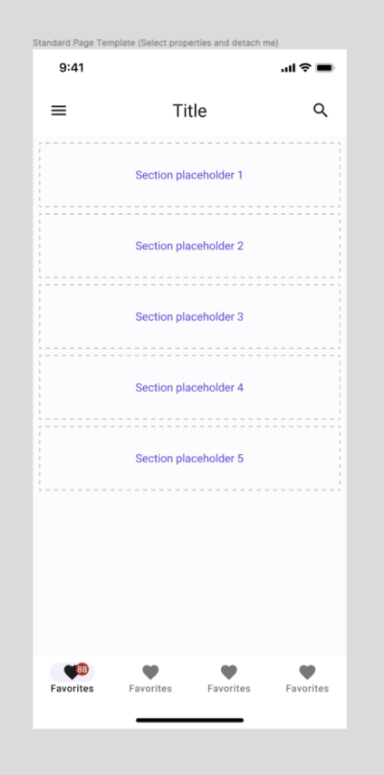

# Page Templates

## How to Use Page Templates

The Uno Toolkit provides useful templates with proper layer structures to generate XAML and preview designs through the Uno plugin.

> [!Video https://www.youtube-nocookie.com/embed/rp5XIYTZDx0]

### General Guidelines

- Page instances **must always be detached** from their *Main Components*.
- **Components placed within pages must not be detached** from their *Main Components*.
- The *Body* layer is where you apply background colors.
- The *Body* layer must contain all components added to the page.
- Scrollable content must be housed within the `Content Scrollable` layer.

### Steps

1. Pick the required template from the *Assets* section in Figma and drag it to the work canvas.
2. Select your desired variants from the Figma *Design* panel (on the right of the screen).
3. Right-click on the template and select *Detach instance* from the contextual menu.
4. Optionally, choose to rename it at this point.
5. To add components inside the page, drag them from the *Assets* panel into the Auto layouts named *Section placeholder #*.
6. Hide or delete the placeholder outlines and labels.
7. Delete unused placeholders.

## Available Variants

- Bottom Navigation: *True/False*
- Top AppBar: *True/False*
- AppBar Type: *iOS/Android*

