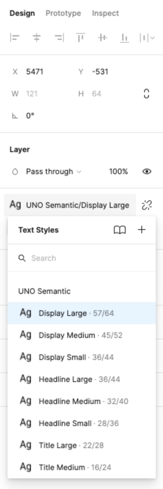

# How to Use Fonts

Uno Toolkit comes pre-loaded with 19 semantic font styles to ensure your project will look great on any target platform. All the Toolkit components use these styles and the plugin can generate the necessary XAML for all of them with zero extra effort on your part.

## General Guidelines

- Each native platform uses a different default font, make sure you download the proper fonts for your project from their respective providers:
            \- Material [Roboto](https://fonts.google.com/specimen/Roboto)
            \- Cupertino [SF-Pro](https://developer.apple.com/fonts/)
            \- Fluent [SegoeUI-Variable and Static Fonts](https://docs.microsoft.com/en-us/windows/apps/design/downloads/#fonts)

Uno will apply the proper native fonts, sizings, and spacings based on the Toolkits semantic text styles used in your design.

- **Do not resize text styles**. When required, select one of the 19 provided. Any changes to font type, spacing, or size within a text style will be overridden by the plugin in the generated XAML;
- Color styles can be changed;
- Text styles can be changed;
- Use *TextBlock* component when generating new text labels or paragraphs;
- To apply a text style to a custom layout follow the steps below.

## Steps

1. Select text layer (If it has no style applied already go to step 2, else go to step 3)
2. From the *Text* section of the Figma `Design` panel and click the `Style` button
3. Click on the desired style from the Text Style Panel



## Toolkit Type Styles

```
Display Large
Display Medium
Display Small

Headline Large
Headline Medium
Headline Small

Title Large
Title Medium
Title Small

Label Large
Label Medium
Label Small
Label Extra Small

Body Large
Body Medium
Body Small

Caption Large
Caption Medium
Caption Small
```
