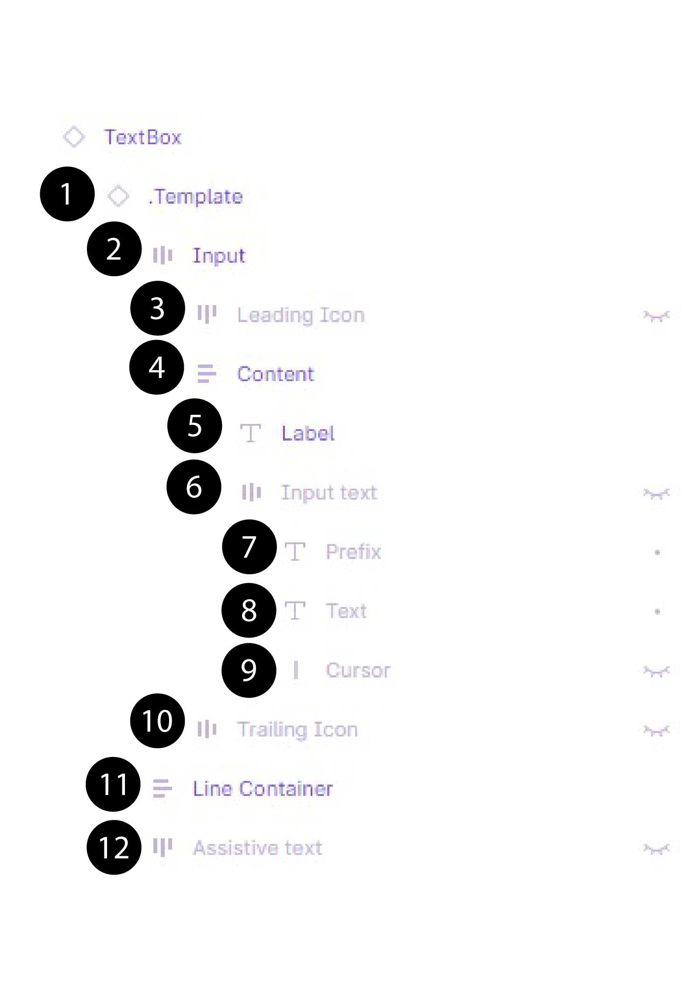
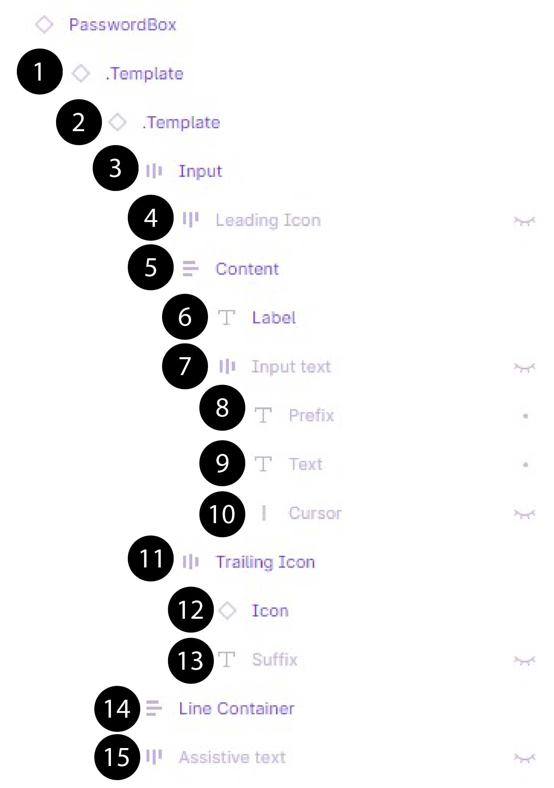

# How to Build a Simple Login Page with the Uno Figma Plugin for Designers

Follow this step-by-step guide to learn how to build a simple login page.

## Prerequisites and Setup

Before starting, review the [Get Started](xref:Uno.Figma.GetStarted) guide for the Uno Figma plugin.

## Step 1: Setting the Page Template

### How to Create a New Page?

1. Drag the Page Template from the Page Templates component library into your Figma project.
2. Select the page to see a purple outline around it.
3. Detach the page component by right-clicking and choosing 'Detach Instance'.
4. Rename the page by double-clicking the layer's name.

### Understanding the Layers in a Page Template

- **Status Bar:** For iOS or Android, used only for presentation.
- **Body:** Contains the Bottom Navigation Bar component and Page layers.
- **Top App Bar:** Contains commands and page title.
- **Page:** Contains all Content, including Scrollable layers.
- **Content.Scrollable:** Contains all scrollable content.
- **Section Placeholder (2):** Added to help insert content faster.

## Step 2: Creating a Form

### How to Add a Text Box?

1. Drag the Text Box from the Text components library into your project.
2. Customize the look and content using the control panel.
3. Adjust the width and edit the text as needed.
4. Make the Assistive label invisible if not used.

### How to Change the Icon of a Text Box?

1. Select the icon and choose a new one from the components control panel.

### Understanding the Layers in a Text Box

- **Template:** Main template link.
- **Input:** Contains Suffix, Icons, and Input text.
- **LeadingIcon:** Icon on the left.
- **Label:** Name of the text box.
- **Text:** User-input text.
- **Cursor:** Vertical bar for illustrative purposes.
- **TrailingIcon:** Icon on the right.
- **Line Container:** Line under the text box.
- **Assistive text:** Text under the text box.

### How to Add a Password Box?

1. Drag the Password Box from the Text components library.
2. Customize and adjust the Password Box as needed.

### How to Change the Icon of a Password Box?

1. Select the icon and choose a new one from the components control panel.

### Understanding the Layers in a Password Box

- **Template 1 & 2:** Main templates for Password Box and Text Box.
- **Input:** Contains TrailingIcon and content.
- **LeadingIcon:** Icon on the left.
- **Label:** Name of the box.
- **Input text:** Contains Cursor, Text, and Prefix.
- **TrailingIcon:** Contains Suffix and Icon.
- **Line:** Horizontal line under the box.
- **Assistive text:** Text under the box.

### How to Add a Button?

1. Drag the Button from the Basic Input components library.
2. Customize the look and content as needed.

## Step 3: Adjusting the Layout

### How to Edit the Spacing Between Elements?

1. Select the layer group and adjust the spacing in the Auto Layout panel.

### How to Edit the Padding Around Items?

1. Select the layer group and adjust the padding in the Auto Layout panel.

### How to Make the Content Centered Vertically?

1. Adjust the height of the form section to 'fill container'.

## You Did It!

Your page is now complete and should look like this.

