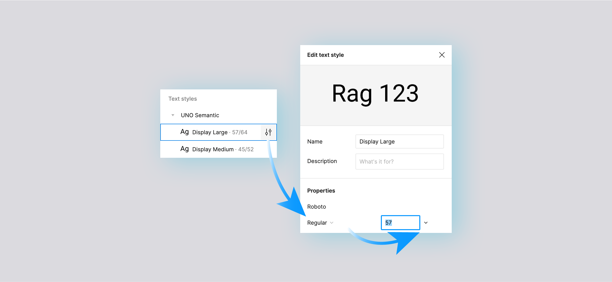

# How to Override Type Sizing
Advanced feature
 

## Overview

Uno Figma Platform Material Toolkit (UFPMT) includes 19 Type Styles defining sizes and weights used throughout the design system. Preview 5 of UFPMT adds support to change the size and/or weight of all of it's preset Type Styles

> [!IMPORTANT]
> This is not and instance override. Changing a Type Style will affect all components using it in the file.

 ## How it works

It's too easy (to break things) with this feature, first locate the *Text Styles* area from the *Design* Pane and expand the *Uno Semantic* grouping so you can see the list of type styles. Then hover over the type style you wish to edit until the *Settings* icon appears (see below) and click it. From the *Edit text style* panel you can change the font's weight and/or size and your design should start reflowing immediatly. You can change as many styles as required for your project.

>[!NOTE] Font family, line heigth and caracter spacing are not currently supported overrides when generating code from Figma.

## Components without support for text style override

The following components may reflow in odd way or not at all:

* DatePicker
* PersonPicture
* RatingControl
* SwipeControl