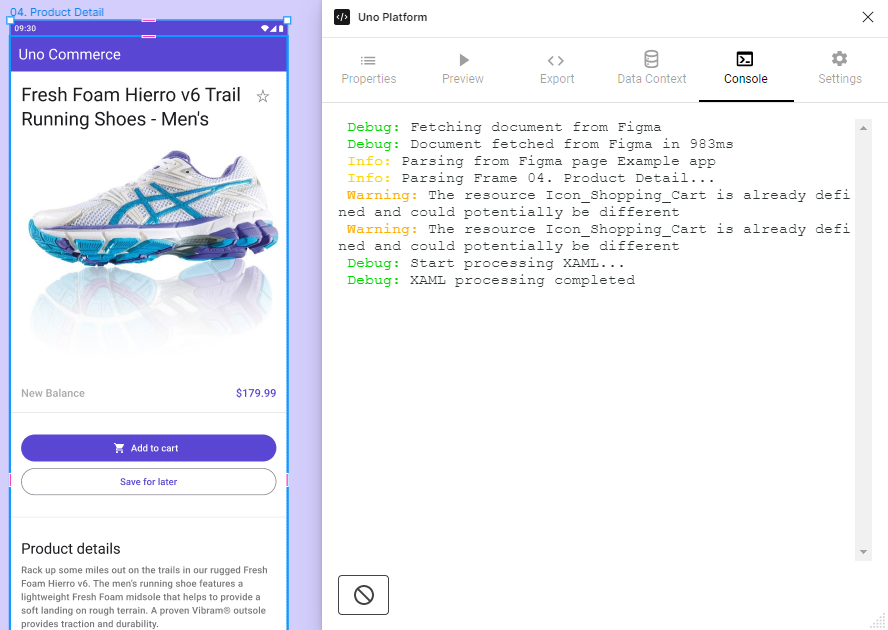

# Console Tab

The Console tab allows you to check debug information and warnings of layouts rendering. Information such as document fetching, frame parsing and duplicate localization are displayed.

