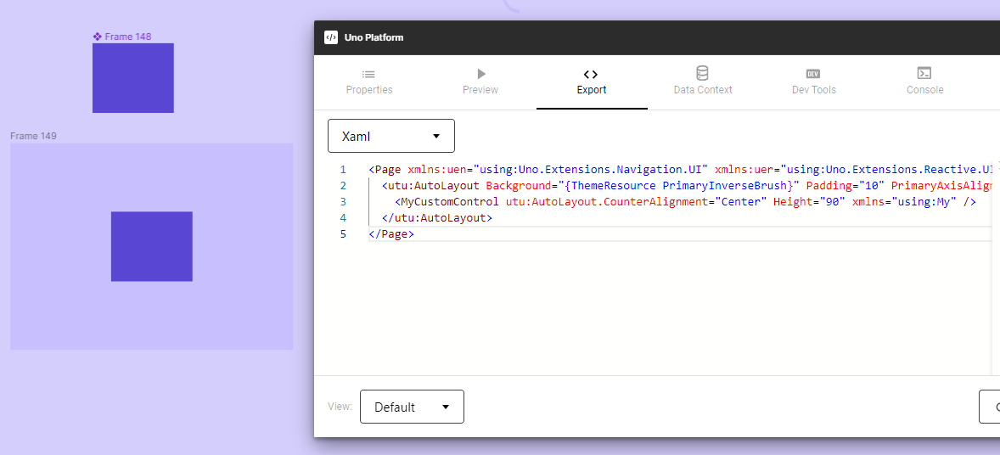

# External Custom Components in Uno Figma Plugin

## Integrating Third-Party or Custom Controls

In many app development scenarios, third-party or custom controls not present in the WinUI control library are essential. The Uno Figma Plugin provides a feature to integrate these external custom components seamlessly into your design by reserving space in the exported layout.

> [!IMPORTANT]
> This feature is intended for **existing** external components and should not be confused with the *View Hierarchy* feature in the [Export Tab](export-tab.md), which generates components from your design. It is specifically for using components not defined in your Figma document.

### Steps to Implement Custom Components

To effectively use this feature in Figma, you need to create and set up a Component. Once configured, every instance of this component will translate into corresponding generated code in the app development process.

#### 1. **Create a Component Frame**

- Draw a frame in your Figma canvas.
- Transform this frame into a Component.

#### 2. **Configure in Uno Plugin**

- Open the Uno Figma Plugin.
- Navigate to the *Properties Tab*.

#### 3. **Enable Custom Component**

- With your Component selected, activate the *Custom Component* toggle.

#### 4. **Specify Control Details**

- Fill in the details as per your custom control's specifications. This ensures accurate space reservation and integration.

   

> [!NOTE]
> Adding an instance of your custom component in a screen will prompt the plugin to generate the appropriate XAML code, ensuring proper integration of the custom control into your app's UI.

   

### Using Custom Components

The ability to include external custom components expands the versatility of the Uno Figma Plugin, bridging the gap between unique control requirements and standard design elements. This feature ensures that all necessary UI components, including those from external libraries, are accounted for during the design-to-development transition.
