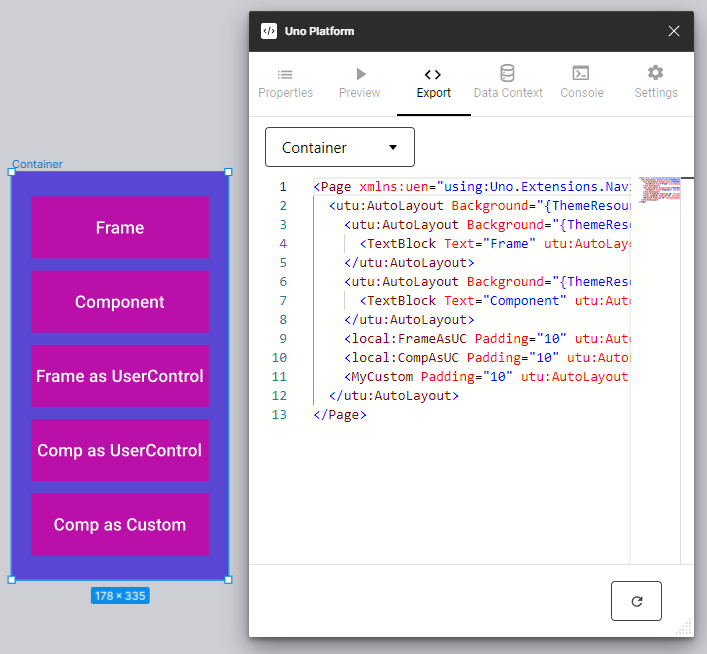
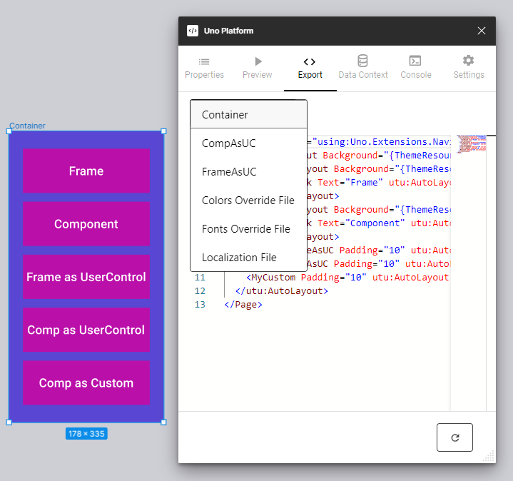
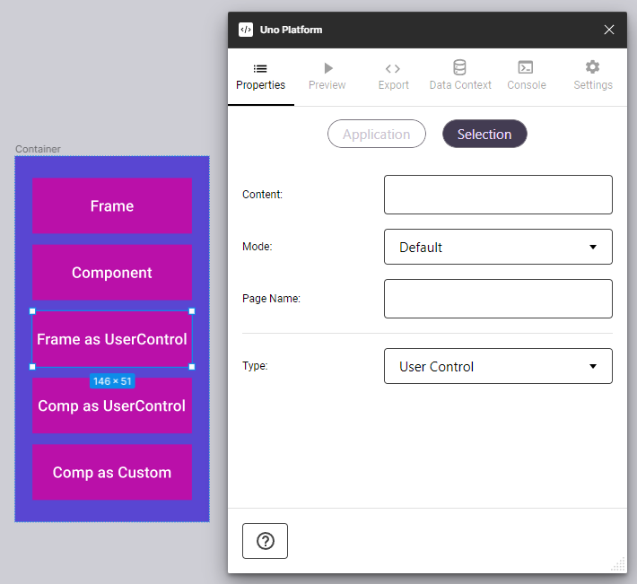
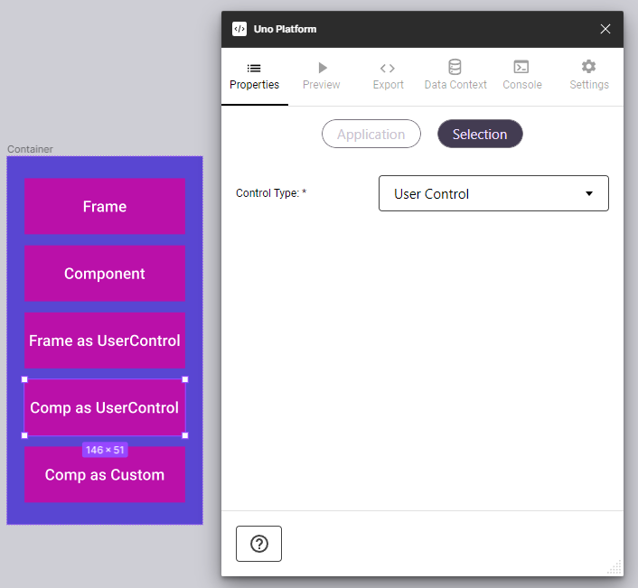
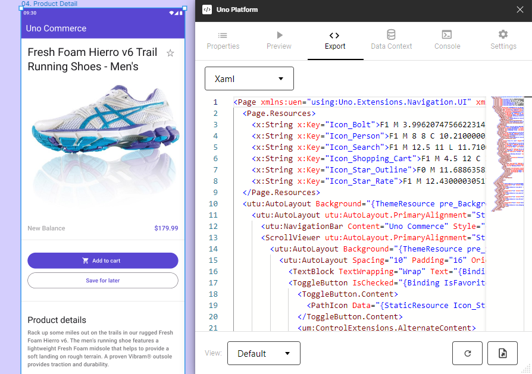

# Export Tab

## Using the Export Tab

The Export tab is another powerful tool to inspect generated code and export to developers.

The left-top dropdown allows you to alternate among `Xaml`, `Colors Override File`, `Fonts Override File` and `Localization File`. Contextual controls at the bottom of the tab allow you to: set view type, refresh view and export the code;

Exporting process is done by adding the tab content to the clipboard, so you can paste it into your favorite text editor.

> [!NOTE]
> Proper generation depends on usage of the proper templates and components, please read the [New design guidelines](../designers/starting-new-design.md) before starting a new project;

### Steps to Use Export Tab

1. Select the page or component to inspect;
2. From Figma's *Plugins* menu select *Uno Platform*;
3. Click the *Export* tab (third one from the left);
4. Click the *Refresh* button at the bottom of the tab.

## View Hierarchy

In order to allow designers to work with reusable content, plugin can generate code for User Controls, Custom External Controls, Pages and more.
Plugin will export controls with own code (like User Controls and Pages) in separated files and reference those in the main container code.
The final code will be flexible, cleaner and easier to understand and reuse.  

### How to use it?

Generating reusable code is simple and there are many different ways to create it using the plugin:

1. Converting any frame, with or without content, in a component - both component and instances will result in AutoLayout containers in the exported code.
2. Using Properties Tab, setting the Type field as Page or User Control - plugin will generate both: content code for those controls and their references in the full exported code.

3. Converting any frame, with or without content, in a component and using Properties Tab, setting the Control Type field - plugin will generate both: content code for those controls and their references in the full exported code.

> [!NOTE]
> To override your application's resources, simply copy the text there into your Override file, as documented in the [Uno Themes documentation](https://platform.uno/docs/articles/external/uno.themes/doc/material-getting-started.html#customize-color-palette).

> [!WARNING]
>
> This features will only work if the document has been created by duplicating the [Uno Toolkit](../designers/starting-new-design.md) document.